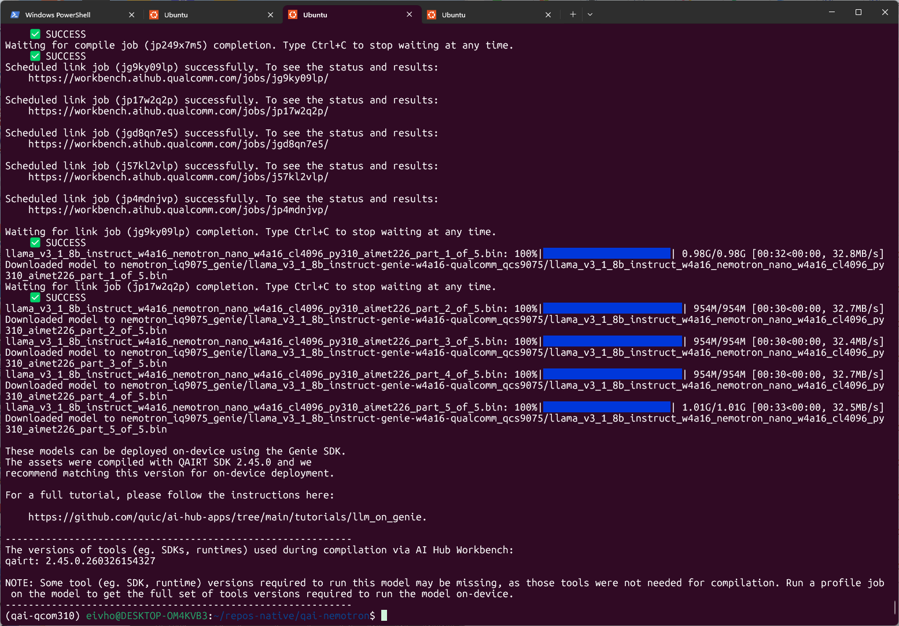
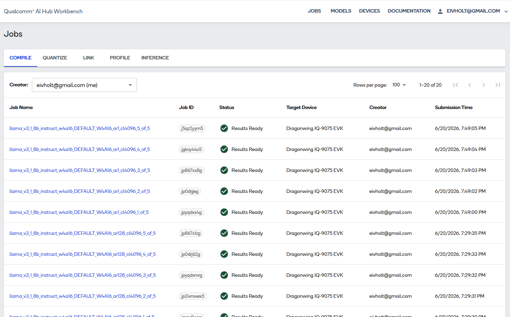

# Deploying NVIDIA Llama-3.1-Nemotron-Nano-8B-v1 on a Qualcomm Dragonwing IQ-9075 EVK

**Author:** Eivind Holt, June 2026  
**Repository:** [github.com/eivholt/qai-nemotron](https://github.com/eivholt/qai-nemotron)  
**Target:** Qualcomm Dragonwing IQ-9075 EVK / QCS9075 / Hexagon v73. Hardware sponsored by Qualcomm 🙏  
**Model:** `nvidia/Llama-3.1-Nemotron-Nano-8B-v1`  
**Runtime result:** 183 ms time to first token and 10.03 generated tokens/s on the EVK

---

## What this tutorial accomplishes

In this tutorial I share my journey taking NVIDIA's BF16 `Llama-3.1-Nemotron-Nano-8B-v1` checkpoint, quantizing it to Qualcomm's W4A16 deployment format, compiling it for QCS9075 in Qualcomm AI Hub Workbench, installing the matching QAIRT runtime on a physical IQ-9075 EVK, and running the model through Genie on the Hexagon HTP/NPU.

My friend Christian coined the phrase "Like applause at a jazz concert". In the same way non-jazz afinados may be puzzled by spontanious bursts of cheer in the middle of 23 minute jazz jams, the accomplishments of this technical exercise may not be obvious and also easily misinterpreted.

The result is not a CPU-only GGUF experiment. The final bundle uses the `QnnHtp` backend and the physical EVK's Hexagon v73 DSP. In the validated run, the model generated coherent output at 10.03 tokens/s, essentially matching Qualcomm's published performance for stock Llama 3.1 8B on the same platform.

### An important architectural clarification

This specific Nemotron model is **not** a new Mamba or mixture-of-experts network. NVIDIA identifies it as a dense decoder-only Transformer with the same network architecture as Llama 3.1 8B Instruct. Its differentiation is in NVIDIA's post-training: reasoning on/off behavior, tool calling, RAG, coding, instruction following, preference optimization, and reinforcement learning.

That architectural compatibility is why Qualcomm's existing Llama 3.1 8B implementation could be used as the deployment scaffold. The accomplishment is therefore:

> Running NVIDIA's Nemotron-specific post-trained weights on Qualcomm's optimized Llama 3.1 execution path, not adding a new Mamba/MoE operator stack to QAIRT.

---

## The end-to-end pipeline


```text
NVIDIA BF16 Hugging Face checkpoint -> 

Qualcomm Llama 3.1 8B PyTorch wrapper -> 

Fixed-shape ONNX graphs -> 

AIMET-ONNX W4A16 calibration -> 

model.encodings + model.data + ONNX graphs -> 

Qualcomm AI Hub Workbench
  - split into five model parts
  - compile prompt processor (sequence length 128)
  - compile token generator (sequence length 1)
  - link shared-weight binaries for QCS9075 -> 

Five-bin Genie bundle -> 

QAIRT 2.45 + Genie + QnnHtp -> 

Hexagon v73 on the physical IQ-9075 EVK
```

### Technical concepts

**W4A16** means most weights are represented with 4-bit integers while activations remain 16-bit. Qualcomm also keeps selected tensors, including the language-model head and KV-cache interfaces, at higher precision where needed.

**ONNX** short for Open Neural Network Exchange, is a portable model format for representing machine-learning models independently of the framework they were trained in. A model trained in PyTorch, TensorFlow, or another framework can be exported to ONNX, then optimized, quantized, compiled, or run by different inference engines and hardware toolchains. In practice, ONNX acts as an interchange layer: it describes the model graph, operators, tensor shapes, weights, and metadata in a standardized way so deployment tools can consume the model without depending directly on the original training framework.

**AIMET** short for AI Model Efficiency Toolkit, is Qualcomm’s open-source toolkit for compressing and optimizing neural networks before deployment. It is commonly used for quantization, calibration, and accuracy recovery, helping convert large floating-point models into lower-precision formats such as INT8 or W4A16 while preserving as much model quality as possible. In a Qualcomm deployment pipeline, AIMET often sits between model export, such as ONNX, and hardware compilation, producing quantization encodings and calibrated artifacts that downstream Qualcomm tools can compile for efficient inference on target accelerators.

**QuantSim** is AIMET's quantization simulation graph. It inserts quantize/dequantize operations into ONNX so calibration can estimate scales and the host can approximate on-device numerical behavior before compilation.

**Prompt processor versus token generator:** the prompt processor consumes chunks of the input, 128 tokens per invocation in this deployment. The token generator consumes one token at a time after the first output token. Both graphs must work; validating only the calibration-shape graph is insufficient.

**KV cache** stores attention keys and values from previous tokens. It avoids recomputing the whole prompt for every generated token, but its dimensions depend on context length and are therefore compiled into the deployment graphs.

**HTP/cDSP:** Qualcomm's Hexagon Tensor Processor is accessed through the compute DSP and FastRPC transport. The application uses host-side QNN libraries, DSP-side skel libraries, a kernel FastRPC device, and a userspace daemon. A failure in any layer can appear as a generic device-creation error.

---

## Hardware and software used for the successful run

### Host workstation

| Component | Validated setup |
|---|---|
| Host OS | Windows host with WSL2 Linux |
| GPU | NVIDIA GeForce RTX 5090, compute capability `sm_120` |
| System RAM | 192 GB |
| Python environment | Conda, Python 3.10.20 |
| Repository location | WSL-native Linux filesystem, not `/mnt/c` |
| Peak full-quantization RSS | 174 GiB |
| Full quantization wall time | 45 minutes |
| Disk use during development | More than 128 GB under the project, plus shared caches |

### Target device

| Component | Setup |
|---|---|
| Board | Qualcomm Dragonwing IQ-9075 EVK |
| Chipset | QCS9075 |
| Memory | 36 GB LPDDR5 |
| Operating system | Ubuntu on the EVK |
| Accelerator | Hexagon v73 HTP/NPU |
| QAIRT runtime | `2.45.0.260326`, matching compile build `2.45.0.260326154327` |
| Runtime executable | `genie-t2t-run` |

### Why this host is unusually large

The final W4A16 checkpoint itself is only part of the story. During QuantSim creation, ONNX export, calibration, and checkpoint serialization, the host temporarily holds large graph structures and external tensor data. The successful 4K-context run reached roughly 174 GiB resident memory. A smaller workstation may complete a reduced smoke test but still fail on the full `4096 / 2048 / 20` run. A few detours arose due to compatibility issues with the RTX 5090 (sm_120); this tutorial addresses these, as that card is the only feasibly obtainable “enthusiast-level” option capable of the task at hand.

For a lower-memory host, use a bare-metal Linux server or cloud A100/H100-class machine with at least 192-256 GB system RAM. The compiled bundle can then be copied back to the EVK.

---

# Prepare WSL2 and storage

## Work in the Linux filesystem

Store the project under the WSL filesystem:

```bash
mkdir -p ~/repos-native/qai-nemotron
cd ~/repos-native/qai-nemotron
```

Windows Subsystem for Linux (WSL2): Avoid doing large ONNX and checkpoint operations under `/mnt/c`. Cross-filesystem I/O is slower, and this workflow performs hundreds of gigabytes of reads and writes.

## Make enough memory visible to WSL

The first failed runs were killed by Linux even though the Windows host had 191 GB of RAM. WSL2 had its own lower memory limit.

Create this Windows-side file if it does not already exist:

```text
C:\Users\<YOUR_WINDOWS_USER>\.wslconfig
```

Example for a very high-memory workstation:

```ini
[wsl2]
memory=176GB
swap=96GB
```

Then run in PowerShell or Command Prompt:

```powershell
wsl --shutdown
```

After reopening WSL, verify what Linux can see:

```bash
free -h
swapon --show
grep -E 'MemTotal|SwapTotal' /proc/meminfo
```

**Gotcha:** the exact values must leave enough memory for Windows. The full run in this tutorial used about 173.6 GiB RSS. If your host cannot expose that much, move quantization to a server, such as [Lambda Cloud](https://lambda.ai/).

## Plan for disk use

Before starting:

```bash
df -h ~
```

A practical recommendation is at least 200 GB free. Multiple failed or validation checkpoints can each contain a 30+ GB `model.data` file, several ONNX graphs, encodings, temporary archives, Hugging Face weights, CUDA packages, and pip/Conda caches.

---

# Create a version-aligned host environment

The environment is the most important reproducibility detail in this tutorial.

My first Python 3.12 environment with AIMET-ONNX 2.33 and ONNX Runtime GPU 1.22 completed quantization, but the deployment-shape graphs emitted multilingual token salad (™). The graph used directly for calibration could produce a correct token, while the separately exported 128-token and 1-token graphs were wrong. Quantization success messages did not guarantee a valid checkpoint.

The working environment aligned to Qualcomm's Llama 3.1 recipe wherever possible, while retaining a newer PyTorch build for the RTX 5090.

## Create a Python 3.10 Conda environment

```bash
conda create -n qai-qcom310 python=3.10 pip -y
conda activate qai-qcom310

unset PYTHONPATH
export PYTHONNOUSERSITE=1

python -m pip install --upgrade pip setuptools wheel
```

Verify:

```bash
which python
python -V
```

Expected:

```text
/home/<user>/miniconda3/envs/qai-qcom310/bin/python
Python 3.10.x
```

## Install Blackwell-compatible PyTorch

Qualcomm's model-specific package originally pinned PyTorch 2.4.1/CUDA 12.1. That build recognized the RTX 5090 but lacked `sm_120` kernels. PyTorch warned that the GPU was incompatible.

Install CUDA 12.8 wheels instead:

```bash
python -m pip install \
  torch==2.7.1 \
  torchvision==0.22.1 \
  --index-url https://download.pytorch.org/whl/cu128
```

Test a real CUDA kernel, not just device enumeration:

```bash
python - <<'PY'
import torch

print('torch:', torch.__version__)
print('CUDA runtime:', torch.version.cuda)
print('CUDA available:', torch.cuda.is_available())
print('GPU:', torch.cuda.get_device_name(0))
print('capability:', torch.cuda.get_device_capability(0))

x = torch.randn((1024, 1024), device='cuda')
y = x @ x
torch.cuda.synchronize()
print('CUDA matmul passed:', float(y[0, 0]))
PY
```

## Install QAI Hub Models without the Llama extra

Do not install the Llama extra directly in this environment, because it can downgrade PyTorch to the incompatible version.

```bash
cat > /tmp/qai-qcom310-constraints.txt <<'EOF'
numpy==1.26.4
torch==2.7.1
torchvision==0.22.1
transformers==4.45.0
onnx==1.18.0
onnxsim==0.5.0
EOF

python -m pip install \
  -c /tmp/qai-qcom310-constraints.txt \
  numpy==1.26.4 \
  qai-hub-models==0.56.0

python -m pip install \
  -c /tmp/qai-qcom310-constraints.txt \
  transformers==4.45.0 \
  sentencepiece==0.2.1 \
  psutil==6.1.1 \
  onnx==1.18.0 \
  onnxsim==0.5.0
```

## Install Qualcomm's AIMET-ONNX 2.26 wheel

```bash
python -m pip install \
  'https://github.com/quic/aimet/releases/download/2.26.0/aimet_onnx-2.26.0+cu121-cp310-cp310-manylinux_2_34_x86_64.whl'
```

The wheel is built specifically for CPython 3.10, which is why this environment cannot use Python 3.12.

## Install ONNX Runtime GPU last

```bash
python -m pip uninstall -y onnxruntime onnxruntime-gpu
python -m pip install --no-deps onnxruntime-gpu==1.23.2
```

**Gotcha:** `qai-hub-models` metadata may complain that plain `onnxruntime` is absent. Do not install both CPU and GPU distributions just to satisfy metadata. Both provide the same `onnxruntime` Python module, and whichever was installed last can silently replace the other.

## Fix AIMET's `libpython3.10.so.1.0` lookup

The first AIMET 2.26 run failed with:

```text
RuntimeError: Unable to run function PtrToInt64
libpython3.10.so.1.0: cannot open shared object file
```

The library existed inside the Conda environment, but the native loader did not search that directory.

```bash
export LD_LIBRARY_PATH="$CONDA_PREFIX/lib${LD_LIBRARY_PATH:+:$LD_LIBRARY_PATH}"
```

Make it persistent for this environment:

```bash
mkdir -p "$CONDA_PREFIX/etc/conda/activate.d"

cat > "$CONDA_PREFIX/etc/conda/activate.d/qai-libpython.sh" <<'EOF'
export LD_LIBRARY_PATH="$CONDA_PREFIX/lib${LD_LIBRARY_PATH:+:$LD_LIBRARY_PATH}"
EOF
```

Test:

```bash
python - <<'PY'
import ctypes
lib = ctypes.CDLL('libpython3.10.so.1.0', mode=ctypes.RTLD_GLOBAL)
print('Loaded:', lib._name)
PY
```

## Verify the exact environment

```bash
python - <<'PY'
import sys
from importlib.metadata import PackageNotFoundError, version
import torch
import onnxruntime as ort
import aimet_onnx

packages = [
    'qai-hub-models', 'aimet-onnx', 'onnx',
    'onnxruntime-gpu', 'transformers', 'torch',
    'torchvision', 'numpy'
]

print('Python:', sys.version)
for package in packages:
    try:
        print(f'{package:22} {version(package)}')
    except PackageNotFoundError:
        print(f'{package:22} not installed')

print('GPU:', torch.cuda.get_device_name(0))
print('Capability:', torch.cuda.get_device_capability(0))
print('ORT providers:', ort.get_available_providers())
print('AIMET:', aimet_onnx.__file__)
PY
```

The validated core versions were:

```text
Python                 3.10.20
qai-hub-models         0.56.0
aimet-onnx             2.26.0+cu121
onnx                   1.18.0
onnxruntime-gpu        1.23.2
transformers           4.45.0
torch                  2.7.1+cu128
torchvision            0.22.1+cu128
```

Save the environment for in case you mess things up later:

```bash
python -m pip freeze > qai-qcom310-successful-freeze.txt
```

---

# Verify AIMET before spending an hour on the model

## Run a tiny QuantSim test

A successful import is not enough. Exercise AIMET's native `libpymo` path and create a QuantSim session:

```bash
python - <<'PY'
import gc
import numpy as np
from onnx import TensorProto, helper, numpy_helper
from aimet_onnx.quantsim import QuantizationSimModel

input_info = helper.make_tensor_value_info('input', TensorProto.FLOAT, [1, 4])
output_info = helper.make_tensor_value_info('output', TensorProto.FLOAT, [1, 4])
weight = numpy_helper.from_array(np.eye(4, dtype=np.float32), name='weight')
node = helper.make_node('MatMul', ['input', 'weight'], ['output'])
graph = helper.make_graph([node], 'aimet_test', [input_info], [output_info], [weight])
model = helper.make_model(graph, opset_imports=[helper.make_opsetid('', 13)])
model.ir_version = 9

sim = QuantizationSimModel(
    model=model,
    providers=['CUDAExecutionProvider', 'CPUExecutionProvider'],
)

print('QuantSim providers:', sim.session.get_providers())
print('AIMET libpymo test passed')
del sim
gc.collect()
PY
```

Expected:

```text
QuantSim providers: ['CUDAExecutionProvider', 'CPUExecutionProvider']
AIMET libpymo test passed
```

A cleanup-only `__del__` warning after process exit can be ignored if the test itself passed and returned exit code zero.

---

# Quantize Nemotron

## Authenticate with Hugging Face if needed

Accept the relevant model licenses and log in:

```bash
python -m pip install 'huggingface_hub[cli]'
hf auth login
```

## Run a small validation quantization first

```bash
cd ~/repos-native/qai-nemotron
conda activate qai-qcom310
export LD_LIBRARY_PATH="$CONDA_PREFIX/lib${LD_LIBRARY_PATH:+:$LD_LIBRARY_PATH}"

rm -rf nemotron_validation_ckpt_py310_aimet226

PYTORCH_CUDA_ALLOC_CONF=expandable_segments:True \
python -m qai_hub_models.models.llama_v3_1_8b_instruct.quantize \
  --checkpoint nvidia/Llama-3.1-Nemotron-Nano-8B-v1 \
  --context-length 512 \
  --calibration-sequence-length 128 \
  --num-samples 1 \
  --output-dir nemotron_validation_ckpt_py310_aimet226
```

This still loads the entire 8B model and can take 30-60 minutes. The smaller values reduce calibration and graph dimensions; they do not turn the model into a small model.

### Warnings that were nonfatal in this run

You may see:

```text
TracerWarning: Converting a tensor to a Python boolean...
```

```text
The target quantizers could not be found. MatMul exception rule does not apply...
```

```text
Token indices sequence length is longer than the specified maximum...
```

The WikiText warning appears because the dataset loader tokenizes the concatenated corpus before slicing it into context windows. The MatMul messages indicate that individual exception rules were skipped. These warnings were present in my successful run.

## Validate the actual deployment path

Do not test only the graph used directly during calibration. Test the 128-token prompt processor and the sequence-length-1 generator together:

```bash
python -m qai_hub_models.models.llama_v3_1_8b_instruct.demo \
  --checkpoint nemotron_validation_ckpt_py310_aimet226 \
  --context-length 512 \
  --sequence-length 128 \
  --max-output-tokens 16 \
  --seed 42 \
  --prompt 'Explain gravity in one short English sentence.'
```

You should see a switch similar to:

```text
Switching from sequence_length=128 to sequence_length=1
```

The output must remain coherent after the switch.

### Why this validation matters

With the earlier AIMET 2.33 / Python 3.12 stack, quantization printed `completed successfully`, and the large calibration graph could output the correct first token. Yet the 128-token and 1-token deployment graphs generated nonsense. The fix was not more calibration samples; it was the version-aligned environment.

## Run the full 4K-context quantization

```bash
FULL_CKPT=nemotron_nano_w4a16_cl4096_py310_aimet226
rm -rf "$FULL_CKPT"

PYTORCH_CUDA_ALLOC_CONF=expandable_segments:True \
/usr/bin/time -v \
python -m qai_hub_models.models.llama_v3_1_8b_instruct.quantize \
  --checkpoint nvidia/Llama-3.1-Nemotron-Nano-8B-v1 \
  --context-length 4096 \
  --calibration-sequence-length 2048 \
  --num-samples 20 \
  --output-dir "$FULL_CKPT" \
  2>&1 | tee quantize_cl4096_aimet226.log
```

Validated result:

```text
Quantization completed successfully.
Elapsed time: 44:58.61
Maximum resident set size: 182062912 KiB
Exit status: 0
```

The output directory contained:

```text
model.encodings
model.data
model_seqlen2048_cl4096.onnx
model_seqlen128_cl4096.onnx
model_seqlen1_cl4096.onnx
config.json
tokenizer.json
tokenizer_config.json
args.json
```

The shared `model.data` file was approximately 32.1 GB.

## Validate the full checkpoint before cloud compilation

```bash
CKPT=nemotron_nano_w4a16_cl4096_py310_aimet226

python -m qai_hub_models.models.llama_v3_1_8b_instruct.demo \
  --checkpoint "$CKPT" \
  --context-length 4096 \
  --sequence-length 128 \
  --max-output-tokens 32 \
  --seed 42 \
  --prompt 'Explain gravity in one short English sentence.'
```

The validated output began:

```text
Gravity is the force that causes things to attractively accelerate towards...
```

The wording is not perfect, but the output is coherent. That is sufficient to prove that both deployment-shape graphs work locally.

---

# Compile for QCS9075 in Qualcomm AI Hub

## Configure Qualcomm AI Hub Workbench

Obtain an API token from the same [Qualcomm account](https://workbench.aihub.qualcomm.com/account/) you will use to inspect jobs:


```bash
qai-hub configure --api_token YOUR_API_TOKEN
```

## Export for the Dragonwing IQ-9075 EVK

```bash
CKPT=nemotron_nano_w4a16_cl4096_py310_aimet226
OUT=nemotron_iq9075_genie

rm -rf "$OUT"

python -m qai_hub_models.models.llama_v3_1_8b_instruct.export \
  --checkpoint "$CKPT" \
  --device 'Dragonwing IQ-9075 EVK' \
  --context-length 4096 \
  --sequence-length 128,1 \
  --model-cache-mode disable \
  --skip-profiling \
  --skip-inferencing \
  --output-dir "$OUT"
```

### What this command actually does

It does **not** upload the model to your physical EVK. It uploads AIMET/ONNX artifacts to Qualcomm AI Hub Workbench, compiles them for the QCS9075 target, links them into runtime binaries, and downloads a Genie bundle back to the host.

Because the model is split into five parts and needs two sequence lengths, Workbench creates:

- five compile jobs for the 128-token prompt processor;
- five compile jobs for the 1-token generator;
- five link jobs that combine corresponding parts and share weights.

This can take a while, but progress is reported both in client and web app.





### Privacy and licensing note

This step sends model-derived artifacts to Qualcomm's cloud service. Review NVIDIA, Meta, Qualcomm, and organizational policies before using proprietary or restricted checkpoints.

## Inspect the downloaded bundle

The validated bundle was written beneath:

```text
nemotron_iq9075_genie/
  llama_v3_1_8b_instruct-genie-w4a16-qualcomm_qcs9075/
```

It contained five binaries totaling roughly 5 GB:

```text
...part_1_of_5.bin
...part_2_of_5.bin
...part_3_of_5.bin
...part_4_of_5.bin
...part_5_of_5.bin
genie_config.json
htp_backend_ext_config.json
tokenizer.json
tool-versions.yaml
```

The filenames retain `llama_v3_1_8b_instruct` because that is the Qualcomm implementation used for graph construction. The checkpoint name embedded in the filenames and the weights inside the bundle are the Nemotron checkpoint.

Check the required runtime:

```bash
cat "$OUT"/*/tool-versions.yaml
```

Validated output:

```text
qairt: 2.45.0.260326154327
```

---

# Copy the bundle to the EVK

## Transfer the complete directory

From the host:

```bash
BUNDLE="$OUT/llama_v3_1_8b_instruct-genie-w4a16-qualcomm_qcs9075"

rsync -avh --progress \
  "$BUNDLE/" \
  ubuntu@EVK_IP:~/nemotron_genie/
```

Do not copy only the `.bin` files. Genie also needs the tokenizer and JSON configuration files.

---

# Install QAIRT on the EVK

No Python environment is required on the EVK for inference. Genie is a native QAIRT executable.

## Install QAIRT 2.45

Run on the EVK:

```bash
sudo apt-get update
sudo apt-get install -y curl ca-certificates unzip rsync

QAIRT_VER='2.45.0.260326'
QAIRT_ZIP="/tmp/v${QAIRT_VER}.zip"
QAIRT_URL="https://softwarecenter.qualcomm.com/api/download/software/sdks/Qualcomm_AI_Runtime_Community/All/${QAIRT_VER}/v${QAIRT_VER}.zip"

curl -fL --retry 3 "$QAIRT_URL" -o "$QAIRT_ZIP"

TMP_UNZIP="$(mktemp -d)"
unzip -q "$QAIRT_ZIP" -d "$TMP_UNZIP"

sudo mkdir -p "/opt/qairt/${QAIRT_VER}"

if [ -d "$TMP_UNZIP/qairt/${QAIRT_VER}" ]; then
  sudo rsync -a "$TMP_UNZIP/qairt/${QAIRT_VER}/" "/opt/qairt/${QAIRT_VER}/"
else
  sudo rsync -a "$TMP_UNZIP/" "/opt/qairt/${QAIRT_VER}/"
fi

sudo ln -sfn "/opt/qairt/${QAIRT_VER}" /opt/qairt/current
sudo chmod -R a+rX "/opt/qairt/${QAIRT_VER}"

rm -rf "$TMP_UNZIP" "$QAIRT_ZIP"
```

If Software Center requires authentication, download the ZIP on your host and copy it to `/tmp` on the EVK.

## Create a clean QAIRT environment script

The IQ-9075 is QCS9075 with Hexagon v73.

```bash
cat > "$HOME/qairt-env.sh" <<'EOF'
#!/usr/bin/env bash

export QAIRT_HOME='/opt/qairt/current'
export QAIRT_SDK_ROOT="$QAIRT_HOME"
export QNN_SDK_ROOT="$QAIRT_HOME"

export QAIRT_TARGET='aarch64-oe-linux-gcc11.2'
export PRODUCT_SOC='9075'
export DSP_ARCH='73'

# Use one QAIRT/QNN installation only.
export PATH="$QAIRT_HOME/bin/$QAIRT_TARGET:/usr/local/sbin:/usr/local/bin:/usr/sbin:/usr/bin:/sbin:/bin"
export LD_LIBRARY_PATH="$QAIRT_HOME/lib/$QAIRT_TARGET:/usr/lib/aarch64-linux-gnu:/lib/aarch64-linux-gnu"
export ADSP_LIBRARY_PATH="$QAIRT_HOME/lib/hexagon-v73/unsigned"
EOF

chmod +x "$HOME/qairt-env.sh"
source "$HOME/qairt-env.sh"
hash -r
```

Verify:

```bash
printf 'QAIRT_HOME=%s\n' "$QAIRT_HOME"
printf 'LD_LIBRARY_PATH=%s\n' "$LD_LIBRARY_PATH"
printf 'ADSP_LIBRARY_PATH=%s\n' "$ADSP_LIBRARY_PATH"

type -a genie-t2t-run
readlink -f "$(command -v genie-t2t-run)"
```

---

# Install FastRPC and enable the DSP

## Understand error 14001

My first Genie run failed with:

```text
Failed to create device: 14001
Device Creation failure
```

The model binaries had not failed. QNN could not create the HTP device because the EVK lacked the userspace FastRPC library, the FastRPC daemon was not provisioned, and `/dev/fastrpc-cdsp` was accessible only to root. I quickly found this issue reported in Qualcomm repo.

FastRPC is the transport between the ARM CPU process and the compute DSP. The host application loads QNN stub libraries; FastRPC communicates with the DSP process that loads the matching skel libraries.

## Install the Qualcomm FastRPC packages

```bash
sudo apt-get update
sudo apt-get install -y software-properties-common acl

if ! grep -Rqs 'ubuntu-qcom-iot/qcom-ppa' \
    /etc/apt/sources.list /etc/apt/sources.list.d 2>/dev/null; then
  sudo add-apt-repository -y ppa:ubuntu-qcom-iot/qcom-ppa
fi

sudo apt-get update
sudo apt-get install -y \
  qcom-fastrpc1 \
  qcom-fastrpc-dev \
  qcom-libdmabufheap-dev

sudo ldconfig
```

Do not install a second QNN runtime from the PPA unless you intentionally want to replace QAIRT's QNN libraries. Mixing `/usr/lib` QNN libraries with `/opt/qairt` DSP libraries can cause stub/skel version errors.

## Add the user to the FastRPC group

```bash
sudo systemd-sysusers
getent group fastrpc || sudo groupadd --system fastrpc
sudo usermod -aG fastrpc ubuntu
sudo reboot
```

After reconnecting:

```bash
source "$HOME/qairt-env.sh"

id
ls -l /dev/fastrpc-cdsp
ldconfig -p | grep libcdsprpc
systemctl --no-pager --full status cdsprpcd
```

The validated state was:

```text
ubuntu is a member of fastrpc
/dev/fastrpc-cdsp is group-accessible
libcdsprpc.so resolves from /lib/aarch64-linux-gnu
cdsprpcd is active
```

## Validate the Hexagon backend independently

```bash
qnn-platform-validator --backend dsp --coreVersion
qnn-platform-validator --backend dsp --testBackend
```

Expected summary:

```text
Backend Hardware  : Supported
Backend Libraries : Found
Core Version      : Hexagon Architecture V73
Unit Test         : Passed
```

An `Error in saving the results` message can be ignored when the summary reports success.

---

# Run Nemotron on the EVK

## Create a correctly formatted prompt

Use a prompt file with real newlines. Nemotron's reasoning mode is controlled through the system prompt.

```bash
cd ~/nemotron_genie

cat > prompt.txt <<'EOF'
<|begin_of_text|><|start_header_id|>system<|end_header_id|>

detailed thinking off<|eot_id|><|start_header_id|>user<|end_header_id|>

Explain gravity in one short English sentence.<|eot_id|><|start_header_id|>assistant<|end_header_id|>

EOF
```

For reasoning-on experiments, replace the system content with:

```text
detailed thinking on
```

## Run Genie and save a profile

```bash
source "$HOME/qairt-env.sh"
cd ~/nemotron_genie

set -o pipefail

genie-t2t-run \
  -c genie_config.json \
  --prompt_file prompt.txt \
  --profile profile.txt \
  2>&1 | tee genie-run.log

echo "exit code: ${PIPESTATUS[0]}"
```

Validated output:

```text
Using libGenie.so version 1.17.0
[INFO] "Using create From Binary"
[INFO] "Allocated total size = 306545152 across 10 buffers"
[BEGIN]: Gravity is the force that pulls objects toward each other...
[END]
exit code: 0
```

The `rpcmem_android.c` dummy-call messages are informational; the runtime is using the platform FastRPC implementation.

## Interpret the profile

The successful run reported:

| Metric | Result |
|---|---:|
| Model/dialog initialization | 4.06 s |
| Prompt tokens | 29 |
| Prompt-processing rate | 158.05 tokens/s |
| Time to first token | 183.5 ms |
| Generated tokens | 31 |
| Token-generation rate | 10.03 tokens/s |
| Token-generation time | 3.09 s |

The initialization cost is usually paid once in a persistent service. The 10.03 tokens/s decode rate is almost identical to Qualcomm's published result for Llama 3.1 8B W4A16 on IQ-9075, which is strong evidence that the custom Nemotron checkpoint is using the intended HTP path rather than silently falling back to CPU.

The following short demo runs on the EVK and demonstrates Nemotron Nano producing a curl command, extracting a json payload property:


---

# What this deployment proves - and what it does not

## Proven

- NVIDIA's Nemotron-specific Llama 3.1 8B weights can be quantized with AIMET W4A16.
- Qualcomm AI Hub can compile the custom checkpoint for QCS9075.
- The resulting prompt processor and token generator execute through Genie/QnnHtp on Hexagon v73.
- The EVK produces coherent output at about 10 tokens/s.
- The custom checkpoint does not impose an obvious throughput penalty relative to Qualcomm's stock Llama 3.1 8B path.

# Benchmark Findings: Nemotron Nano on the IQ9 EVK

After deploying `nvidia/Llama-3.1-Nemotron-Nano-8B-v1` on the Qualcomm IQ9 EVK, I wanted to understand what the model is actually good at on-device. The practical question was not “does this reproduce NVIDIA’s leaderboard?”, but:

> Can this model help with Linux commands, HTTP requests, EVK-style diagnostics, coding, reasoning, RAG-style extraction, and tool-call-like structured outputs on the IQ9 EVK?

I benchmarked Nemotron Nano against the stock Qualcomm AI Hub Llama 3.1 8B Instruct W4A16 model. I also ran the non-quantized Hugging Face models on an RTX 5090 host as a reference. The host runs were useful because they separated model behavior from the Qualcomm Genie/QNN W4A16 runtime path.

The benchmark implementation lives in:

- `evk_bench/run_genie_bench.py` for Genie/QNN runs on the EVK.
- `host_bench/run_hf_bench.py` for Hugging Face bf16 runs on the RTX host.
- `host_bench/compare_results.py` for host-side result aggregation.
- `host_bench/run_full_compare.sh` for full host comparison runs.

The benchmark cases themselves are defined in `evk_bench/run_genie_bench.py`, so the same prompts and scorers can be reused from both the EVK and host runners.

## Method

On the EVK, each test writes a prompt file and calls:

```bash
genie-t2t-run \
  -c genie_config.json \
  --prompt_file prompt.txt \
  --profile profile.txt
```

The harness captures:

- the raw model output
- the scoreable answer
- Genie profile metrics
- token generation rate
- time to first token
- pass/fail and partial score
- prompt and log paths

For Nemotron, I tested both:

- `detailed thinking off`
- `detailed thinking on`

I also tested several prompt profiles:

| Prompt profile | Purpose |
|---|---|
| `native` | Minimal task text, closest to the model-card style. |
| `strict_v2` | Concise “return exactly one command” style prompt. |
| `direct_final` | Stronger instruction to return only the final artifact. |
| `best_practical_v2` | Mixed profile: stricter for command tasks, native for reasoning/tool/code tasks. |
| `final_only` / `best_practical_v4` | Very strict “no thinking, no prose” prompt. |

The best overall practical prompt was `best_practical_v2`. It did not make Nemotron perfect, but it was the best compromise between avoiding runaway explanations and preserving enough task context for reasoning/code/tool-like cases.

## Scoring

No LLM judge is used. The benchmark uses deterministic checks against predefined ground truth.

| Test type | Validation method |
|---|---|
| Linux/HTTP commands | Required regex groups plus forbidden regexes. |
| Tool-call JSON | Parse the first JSON object and compare expected tool name/fields. |
| RAG JSON | Parse JSON and compare expected fields exactly. |
| JSON exact keys / arrays | Parse JSON and compare exact keys or exact array values. |
| Math/reasoning | Extract `\boxed{...}` and compare expected number or choice. |
| Instruction following | Regex, count, prefix, and forbidden-word checks. |
| Basic code tests | Regex requirements plus Python code fence. |
| Coding unit tests | Extract Python code and run predefined `assert` tests. |

This makes the results reproducible, but strict. For example, `"Duty Manager"` can fail if the expected value is `"duty manager"`, and a command can fail if it is semantically close but misses a required flag.

## Final-Answer Splitting for `<think>...</think>`

Nemotron can emit reasoning inside `<think>...</think>` tags, especially with `detailed thinking on`. If the benchmark scored the entire raw output, valid final answers could be marked wrong simply because the output also contained reasoning text.

To avoid that, I added final-answer splitting in `evk_bench/run_genie_bench.py`:

1. If the output contains `<think> ... </think>`, the harness stores the text inside those tags as `reasoning`.
2. The text after the final `</think>` becomes `final_answer`.
3. By default, scoring uses `final_answer`, not the full raw output.
4. If a `<think>` tag is opened but never closed, the result is marked as `reasoning_open`, and the scoreable final answer is empty.

The result JSON stores both:

- `raw_answer`: the full generated output
- `reasoning`: extracted thinking text
- `answer`: the scoreable final answer
- `reasoning_open`: whether the model failed to close a thinking block

This mattered a lot. Several reasoning/math cases looked bad before splitting because the correct `\boxed{...}` answer appeared after the reasoning block. Final-answer splitting made those cases score according to the actual final output rather than the scratch work.

However, splitting does not solve every problem. If the model spends the entire token budget inside an unclosed `<think>` block, there is no final answer to score. Increasing the token cap helps expose this failure mode, but it does not always improve accuracy.

## Two Classes of Tests

The results split into two major groups.

### Class 1: Operational Command and Diagnostic Tasks

These were the original practical EVK-oriented tests:

- Ubuntu command generation
- `curl` / HTTP command generation
- QNN / HTP / FastRPC diagnostics
- Genie profile parsing
- Linux service and library troubleshooting
- exact shell snippets

These tests are useful for an EVK assistant, but they do not closely match Nemotron’s advertised benchmark strengths. They reward concise command syntax, exact Linux flags, operational troubleshooting, and exact tool-schema compliance.

Nemotron struggled in this class.

Common failure patterns:

- inventing non-existent commands, such as `ssh log` or `systemdctl`
- using wrong flags, such as malformed `journalctl` or `curl`
- returning explanations instead of commands
- producing near-valid JSON but wrong tool names or fields
- mutating identifiers in code, such as `build_llamme31_prompt`
- using extra token budget to continue explaining instead of improving the final artifact

### Class 2: Nemotron-Friendly Self-Contained Tasks

I added a second class of tests closer to the model’s advertised strengths:

- executable Python coding unit tests
- prompt-contained RAG / fact extraction
- logical reasoning
- arithmetic reasoning
- static toy tool selection
- exact JSON output
- instruction following

These avoid Qualcomm, IQ9, QNN, Genie, and post-training-time system details. All facts needed for the task are inside the prompt.

The strongest contrast came from comparing the old operational suite to this newer self-contained suite.

| Model / mode | Old operational tests | Old avg | New Nemotron-style tests | New avg |
|---|---:|---:|---:|---:|
| EVK Nemotron W4A16, thinking off | 6/20 | 0.527 | 6/8 | 0.900 |
| Host Nemotron bf16, thinking off | 8/20 | 0.629 | 5/8 | 0.794 |
| Host Nemotron bf16, thinking on | 9/20 | 0.591 | 5/8 | 0.700 |
| Host stock Llama 3.1 bf16 | 10/20 | 0.755 | 6/8 | 0.825 |

The EVK result changed dramatically when the task distribution matched Nemotron’s strengths. On the new suite, EVK Nemotron passed:

| New task category | EVK Nemotron W4A16 |
|---|---:|
| RAG / prompt-contained facts | 2/2 |
| Logical reasoning | 2/2 |
| Static tool selection | 1/1 |
| Executable coding unit tests | 1/3 |

This suggests the model is not generally incapable on-device. It is specifically weak on concise operational command generation and exact shell/tool syntax.

## Original Practical Suite: Nemotron vs Stock Llama

On the original 20-case practical suite, stock Llama was stronger.

| EVK model | Mode / config | Pass | Avg score | Decode tok/s | TTFT |
|---|---|---:|---:|---:|---:|
| Nemotron W4A16 | thinking off, 512 tokens | 5/20 | 0.501 | 9.96 | 220.7 ms |
| Nemotron W4A16 | thinking on, 2048 tokens | 7/20 | 0.557 | 9.77 | 219.0 ms |
| Stock Llama 3.1 W4A16 | greedy, 512 tokens | 10/20 | 0.710 | 10.19 | 220.2 ms |

Thinking-on helped Nemotron a little on the old suite, but not enough to catch stock Llama. It also increased the risk that the answer would be consumed by reasoning text or would not reach a clean final artifact.

## Prompt Strictness and Token Budget

I tested whether stronger prompting and larger token caps could fix the issue.

### Token Cap

A larger cap helped reveal behavior, but did not necessarily improve score.

| EVK Nemotron setting | Pass | Avg score | Avg final chars |
|---|---:|---:|---:|
| `best_practical_v2`, 512 tokens | 6/20 | 0.527 | shorter |
| `best_practical_v2`, 2048 tokens | 6/20 | 0.527 | 2075 chars |
| `best_practical_v4`, 2048 tokens | 4/20 | 0.497 | 143 chars |

Interpretation:

- Small caps can cut off the final answer.
- Large caps let the model continue, but often it continues rambling.
- Very strict prompts make output shorter, but can overconstrain the model and hurt correctness.

### Prompt Style

The best practical setting was `best_practical_v2`:

- stricter final-answer prompting for Linux/HTTP style tasks
- native prompting for reasoning, RAG, code, and tool tasks
- final-answer splitting for `<think>...</think>` outputs

The strictest `final_only` profile reduced verbosity, but hurt command accuracy.

## Host bf16 vs EVK W4A16

To estimate quantization/runtime effects, I ran the same prompts on the RTX 5090 host using Hugging Face bf16 weights.

| Test set | Host Nemotron bf16 | EVK Nemotron W4A16 | Difference |
|---|---:|---:|---:|
| Old 20 tests | 8/20, avg 0.629 | 6/20, avg 0.527 | -0.102 avg |
| New 8 tests | 5/8, avg 0.794 | 6/8, avg 0.900 | +0.106 avg |

On the old operational tests, EVK W4A16 dropped relative to host bf16. That suggests quantization/runtime likely hurts some brittle command-generation behavior.

However, on the new self-contained tasks, EVK W4A16 did not show a falloff. It actually scored higher in that run. Quantization alone does not explain the original poor results. Task shape matters more.

## Neutralized Old Suite

To check whether Qualcomm/IQ9-specific knowledge was the real issue, I created a neutralized version of the old suite in `evk_bench/run_genie_bench.py`:

```bash
--suite neutralized
```

This suite keeps the old task shapes but removes Qualcomm, IQ9, QNN, Genie, and FastRPC-specific content. Examples include:

- generic missing shared library
- generic Ubuntu service logs
- generic `usermod -aG` group task
- generic `curl` status-code task
- generic profile parser
- generic prompt builder

EVK Nemotron result:

| Suite | Pass | Avg |
|---|---:|---:|
| Neutralized old-suite | 2/10 | 0.498 |

This shows knowledge cutoff is not the main issue. Both models are based on Meta Llama 3.1 8B Instruct, whose pretraining data cutoff is December 2023. NVIDIA’s Nemotron Nano model card says the model was trained between August 2024 and March 2025, but its data freshness follows Llama 3.1 / 2023 pretraining data. Meta’s Llama 3.1 8B Instruct card lists the pretraining cutoff as December 2023.

If stock Llama were winning only because of a more recent knowledge cutoff, neutralizing the Qualcomm/IQ9 content should have helped Nemotron much more. It did not. The old-suite weakness appears to be mostly task-shape related: exact Linux command syntax, operational diagnostics, tool-call schema compliance, and concise final-output discipline.

## Additional Nemotron-Style Tests

I also added another batch of 10 Nemotron-flavored tests:

- more executable coding tasks
- more prompt-contained RAG tasks
- small logical reasoning tasks
- exact instruction-following tasks
- toy calculator tool selection

The EVK result was:

| Category | Result | Notes |
|---|---:|---|
| Executable coding | 2/3 | Good on slug normalization and window sums; one failed by rambling instead of returning code. |
| RAG / prompt-contained facts | 0/2 | Semantically close, but strict JSON value/type/casing checks failed. |
| Logical reasoning | 1/2 | Weighted average passed; one grid task was ambiguous and should be revised. |
| Instruction following | 1/2 | Exact JSON array passed; line-prefix constraint failed. |
| Tool selection | 0/1 | Correct tool, but parameter was wrapped as `eval(...)`. |

This reinforced the main pattern: Nemotron often understands the task, but exact-output discipline remains the weak point.

## Interpretation

The main finding is not “Nemotron is bad” or “quantization broke it.”

My interpretation is:

1. **Nemotron performs well when the task matches its advertised strengths.**  
   On self-contained RAG, reasoning, tool choice, and coding-style tasks, EVK Nemotron looked much stronger.

2. **Nemotron is weak at concise operational shell-command generation.**  
   It often knows the general idea but fails exact syntax, invents commands, or explains instead of outputting the artifact.

3. **Stock Llama is better for Linux/HTTP command generation.**  
   On the original practical EVK-assistant suite, stock Llama was more reliable.

4. **Thinking-on helps some reasoning/code cases but is not a universal win.**  
   It can improve tasks where reasoning is useful, but it can also spend the output budget before reaching the final answer.

5. **Prompting helps but does not fully solve exactness.**  
   Stricter prompts reduce rambling, but too much strictness harms accuracy. The best result came from mixed prompting by task type.

6. **Quantization/runtime effects exist but are task-dependent.**  
   Host bf16 was better on old operational tasks, but EVK W4A16 held up well on the new Nemotron-friendly suite.

## Practical Recommendation

For an EVK tutorial, I would present Nemotron Nano as useful for:

- local reasoning
- prompt-contained data extraction
- simple RAG-style workflows
- structured tool selection
- coding assistance when feedback/testing is available

I would not present it as the best choice for one-shot Linux command generation. For that, stock Llama 3.1 8B W4A16 was more reliable in my tests.

---

# References

1. NVIDIA, [**Llama-3.1-Nemotron-Nano-8B-v1 model card**](https://huggingface.co/nvidia/Llama-3.1-Nemotron-Nano-8B-v1) - architecture, post-training, reasoning controls, context length, and benchmarks.
2. Qualcomm, [**LLM On-Device Deployment with Genie**](https://github.com/qualcomm/ai-hub-apps/tree/main/tutorials/llm_on_genie) - QAIRT target installation, environment variables, and prompt-file recommendations.
3. Qualcomm AI Hub Models v0.56.0, [**Llama 3.1 8B Instruct implementation**](https://github.com/qualcomm/ai-hub-models/tree/v0.56.0/src/qai_hub_models/models/llama_v3_1_8b_instruct) - quantization/export workflow and version guidance.
4. Qualcomm, [**Dragonwing IQ-9075 EVK**](https://www.qualcomm.com/developer/hardware/qualcomm-iq-9075-evaluation-kit-evk) - board capabilities and memory configuration.
5. Qualcomm, [**FastRPC**](https://github.com/qualcomm/fastrpc) - DSP transport, group membership, and device permissions.
6. Qualcomm AI Hub Workbench export log and EVK FastRPC bring-up transcript from the validated run.

---
