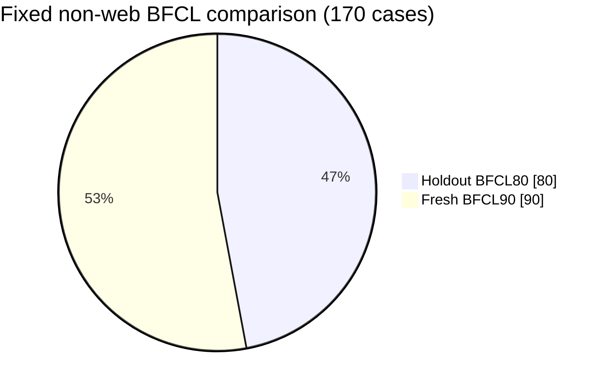
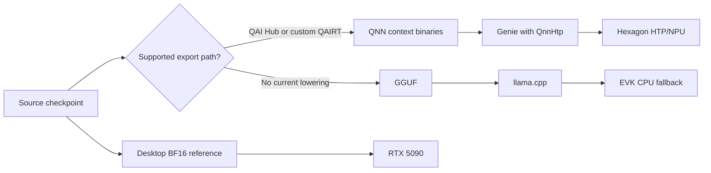
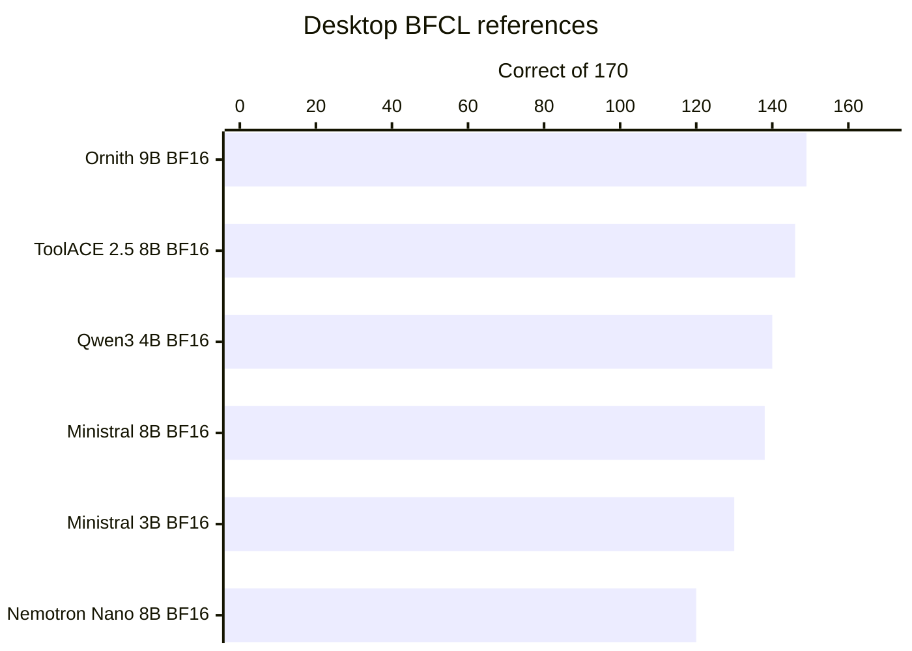
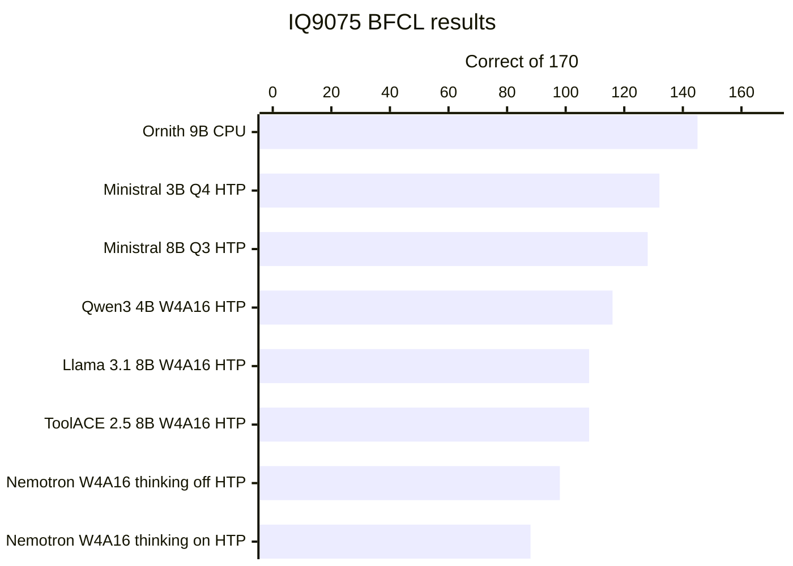

# Agentic LLMs on Dragonwing IQ9075

This tutorial compares small language models as local planning and tool-selection
engines on the Qualcomm Dragonwing IQ9075. It is a companion to
[Deploy Nemotron Nano on Dragonwing IQ9075](https://dragonwingdocs.qualcomm.com/tutorials/deploy-nemotron-nano-on-dragonwing-iq9075),
which explains the complete workstation setup, W4A16 quantization, QAI Hub
compilation, transfer, and Genie validation process.
Those setup steps are not repeated here. The focus is what happens after a model
can answer a prompt: can it reliably choose tools, supply valid arguments, use
results over several turns, and stop without taking unnecessary actions?

> The central finding is that an agentic model is not just a checkpoint. Quantization, chat template, tool-schema renderer, output parser, inference runtime, and client loop can severely impact performance. A smaller model behind its native tool protocol can outperform a larger model behind a plausible but
incorrect protocol!

## Application is key
The models that scored highest in these tests might perform best for some applications. For your application, it might be different. Also, applications might have different model size budgets. The key take-away is to define realistic benchmarks for each application and then run them with promising candidates. New models for agentic AI on edge devices are released frequently, lists like these are outdated almost as soon as they are run. Re-evaluate new models throughout application lifetime, and switch model when performance increases.

## Test setup

The evaluation uses two complementary benchmark collections. They intentionally test
tool use, not factual knowledge.

### BFCL V4 function calling

The [Berkeley Function-Calling Leaderboard](https://gorilla.cs.berkeley.edu/leaderboard.html)
(BFCL) evaluates whether a model
selects the correct function and supplies the correct arguments from one or
more available schemas. BFCL includes simple calls, calls to one of several
functions, multiple and parallel calls, live-schema cases, relevance, and
irrelevance. Irrelevance matters because a useful agent must decline to call a
tool when none can satisfy the request.

The official BFCL V4 deterministic scorer runs through
`agent_arena/bfcl_v4_subset_runner.py`. These are subsets of the official tests, just enough to get a broad evaluation, without having to wait days per model. Web-search agent tests are excluded and no network requests are executed.

- BFCL80: `agent_arena/benchmark_selections/bfcl_v4_holdout80_nonweb_20260627.json`
- BFCL90: `agent_arena/benchmark_selections/bfcl_v4_fresh90_nonweb_20260628.json`

The two non-overlapping selections reduce the risk of tuning an adapter to a
familiar list. Known cases that exceeded the supported Genie context during
selection development were excluded for every model before both lists were
frozen; see [Uniform context-excess exclusions](#uniform-context-excess-exclusions).



### Real-world scenario benchmarks: hospital logistics

The second arena is a realistic local-agent workload. A hospital logistics
coordinator assigns porters or robots, checks cold-chain limits and elevator
state, escalates conflicts, and updates jobs. This represents realistic edge agentic AI tasks, and should be replaced for new applications.

`agent_arena/pydantic_hospital_logistics_arena.py` uses a real Pydantic AI loop
against deterministic mock tools from `agent_arena/hospital_logistics_runtime.py`.
The model chooses the next action, the tool executes, and the result is returned
in the next model turn. It is not required to emit an entire plan in one answer.

The test set has nine short tasks (`O1`-`O5` and `P1`-`P4`), where the model
chooses between a few actions, and five longer tasks (`L0`-`L4`) that require
several tool calls. Fixed rules check each run programmatically; no LLM grades the
answers. Missing or wrong calls, repeated or unnecessary actions, forbidden
tools, calls that never execute, and steps in the wrong order all count against
the model. System failures are rerun and do not count as model mistakes. The
[strict rescoring notes](#strict-rescoring-and-tool-call-policy) explain how
rejected retries and excess calls are retained.

## Models and execution paths

*In the model inventory and benchmark tables, **bold** identifies models or runs
completed on IQ9075. Italics identify Desktop-only checkpoints or runs.*

| Model | Size | Best path tested on IQ9075 | Desktop reference |
|---|---:|---|---|
| **[NVIDIA Llama-3.1-Nemotron-Nano-8B-v1](https://huggingface.co/nvidia/Llama-3.1-Nemotron-Nano-8B-v1)** | 8B | Custom W4A16 Genie, HTP/NPU | BF16, RTX 5090 |
| **[Meta Llama 3.1 8B Instruct](https://huggingface.co/meta-llama/Llama-3.1-8B-Instruct)** | 8B | Qualcomm W4A16 Genie, HTP/NPU | BF16, RTX 5090 |
| **[Mistral Ministral-3-3B-Instruct-2512](https://huggingface.co/mistralai/Ministral-3-3B-Instruct-2512-BF16)** | 3.3B | Custom Q4 Genie/QNN, HTP/NPU | BF16, RTX 5090 |
| **[Qwen3-4B-Instruct-2507](https://huggingface.co/Qwen/Qwen3-4B-Instruct-2507)** | 4B | QAI Hub Models W4A16 Genie, HTP/NPU | BF16, RTX 5090 |
| **[Team-ACE ToolACE-2.5-Llama-3.1-8B](https://huggingface.co/Team-ACE/ToolACE-2.5-Llama-3.1-8B)** | 8B | Custom W4A16 Genie, HTP/NPU | BF16, RTX 5090 |
| **[DeepReinforce Ornith-1.0-9B](https://huggingface.co/deepreinforce-ai/Ornith-1.0-9B-GGUF)** | 9B | Q4_K_M GGUF, eight-core CPU | BF16, RTX 5090 |
| **[Mistral Ministral-3-8B-Instruct-2512](https://huggingface.co/mistralai/Ministral-3-8B-Instruct-2512-BF16)** | 8B | Q3_K_M-to-HTP, QAIRT 2.47, HTP/NPU; Q4 load failed | BF16, RTX 5090 |
| *[Salesforce Llama-xLAM-2-8b-fc-r](https://huggingface.co/Salesforce/Llama-xLAM-2-8b-fc-r)* | 8B | Screened on Desktop; not exported | BF16, RTX 5090 |
| *[MadeAgents Hammer2.1-7b](https://huggingface.co/MadeAgents/Hammer2.1-7b)* | 7B | Screened on Desktop; not exported | BF16, RTX 5090 |
| *[Mistral-7B-Instruct-v0.3](https://huggingface.co/mistralai/Mistral-7B-Instruct-v0.3)* | 7B | Public binary targets incompatible v79 DSP | BF16, RTX 5090 |
| *[Meta Llama 3.2 3B Instruct](https://huggingface.co/meta-llama/Llama-3.2-3B-Instruct) and [Qwen2 7B Instruct](https://huggingface.co/Qwen/Qwen2-7B-Instruct)* | 3B/7B | Diagnostic Desktop runs only | BF16, RTX 5090 |


"Screened" does not mean a model is unusable. It means its Desktop result did not
justify another costly IQ9075 export in this project, or its license/runtime fit
was less attractive than the selected candidates. Model-specific deployment
notes cover the [Ornith NPU blocker](#ornith-npu-blocker-and-cpu-fallback),
[Mistral 7B binary mismatch](#mistral-7b-public-binary-mismatch), and
[Qwen3 export environment](#qwen3-export-environment).



## BFCL results

The table uses the same 170 cases for every row. `Combined` is a convenience
total, not an official BFCL leaderboard metric. Each model uses its best honest
native adapter; the semantic task and official scorer remain unchanged. Genie
rows use settings from the deployed bundle rather than OpenAI request fields;
see [Inference controls and sampler authority](#inference-controls-and-sampler-authority).
Performance differences between running a model on desktop and device can not be isolated to quantization precision drop alone; see [What the BF16-versus-device difference does not prove](#what-the-bf16-versus-device-delta-does-not-prove).

| Model and runtime | BFCL80 | BFCL90 | Combined |
|---|---:|---:|---:|
| *Ornith 9B BF16, RTX 5090* | 71/80 | 78/90 | **149/170 (87.6%)** |
| *ToolACE 2.5 BF16, RTX 5090, Llama JSON* | 74/80 | 72/90 | **146/170 (85.9%)** |
| **Ornith 9B Q4_K_M, IQ9075 CPU** | 69/80 | 76/90 | **145/170 (85.3%)** |
| *Qwen3 4B BF16, RTX 5090* | 70/80 | 70/90 | **140/170 (82.4%)** |
| *Ministral 8B Instruct BF16, RTX 5090* | 69/80 | 69/90 | **138/170 (81.2%)** |
| **Ministral 3B Q4, IQ9075 HTP** | 66/80 | 66/90 | **132/170 (77.6%)** |
| *Ministral 3B BF16, RTX 5090* | 66/80 | 64/90 | **130/170 (76.5%)** |
| **Ministral 8B Q3, IQ9075 HTP** | 67/80 | 61/90 | **128/170 (75.3%)** |
| *Nemotron Nano BF16, RTX 5090* | 59/80 | 61/90 | **120/170 (70.6%)** |
| **Qwen3 4B W4A16 deterministic, IQ9075 HTP** | 58/80 | 58/90 | **116/170 (68.2%)** |
| **Stock Llama 3.1 W4A16, IQ9075 HTP** | 55/80 | 53/90 | **108/170 (63.5%)** |
| **ToolACE 2.5 W4A16 Pythonic, IQ9075 HTP** | 56/80 | 52/90 | **108/170 (63.5%)** |
| **Nemotron W4A16 thinking off, IQ9075 HTP** | 53/80 | 45/90 | **98/170 (57.6%)** |
| **Nemotron W4A16 thinking on, IQ9075 HTP** | 47/80 | 41/90 | **88/170 (51.8%)** |






Runtime failures are never treated as empty model answers. The Ministral 8B Q3
row includes five requests that reached the 300-second hard timeout. All five
are recorded as non-passing calls, even in BFCL irrelevance categories where a
genuine decision not to call a function can be correct.

> Ministral 3B challenges simple model-selection assumptions. It is smaller than
the 8B models, yet its native Mistral tool protocol is disciplined
and stable across Desktop BF16 and Q4 HTP deployment. Parameter count alone is a
poor predictor of agentic reliability.

ToolACE exposes two legitimate protocols on Desktop. Its bundled Llama JSON path is
best for this BFCL slice at 146/170. Its model-card Pythonic path scores 140/170
on BFCL but leads the hospital arena at 10/14. The custom W4A16 IQ9075 export
scores 108/170 with the Pythonic adapter and only 49/80 in the device Llama JSON
probe. Protocol choice therefore remains workload- and deployment-specific;
the device result is not directly interchangeable with the best Desktop row.

Nemotron improved substantially after adopting NVIDIA/BFCL-style schemas,
native placement, final-answer splitting, and conservative parsing. The fresh
90-case set prevented those fixes from becoming test-specific padding. `Thinking
off` remained better for strict function selection; `thinking on` spent more
tokens without improving executable calls. This does not contradict Nemotron's
strength in math, coding, or scientific reasoning.

## Hospital results

The hard slice is stricter than conversational evaluation: a correct action plus
an unnecessary action is still a failure.

`Strict pass` requires every expected call and argument, with no missing,
forbidden, duplicate, excess, unexecuted, or out-of-order action. `Average` is
the mean 0-to-1 ledger score across the 14 cases. It gives partial credit for
satisfied requirements, then subtracts the same strict failure penalties. It is
useful for diagnosing near misses, but strict pass is our criteria.

| Model and runtime | Strict pass | Average |
|---|---:|---:|
| *ToolACE 2.5 BF16, native Pythonic* | 10/14 | 0.789 |
| *Qwen3 4B BF16* | 9/14 | 0.779 |
| *xLAM 2 8B BF16* | 9/14 | 0.767 |
| *Ministral 3B BF16* | 9/14 | 0.643 |
| **Ornith 9B Q4_K_M, IQ9075 CPU** | 9/14 | 0.796 |
| **Ministral 3B Q4, IQ9075 HTP** | 9/14 | 0.643 |
| **Qwen3 4B W4A16 deterministic, IQ9075 HTP** | 9/14 | 0.643 |
| *Ministral 8B BF16, RTX 5090* | 8/14 | 0.655 |
| *Llama 3.1 8B BF16* | 8/14 | 0.601 |
| **Ministral 8B Q3, IQ9075 HTP** | 8/14 | 0.571 |
| *Nemotron Nano BF16* | 6/14 | 0.429 |
| **ToolACE 2.5 W4A16, IQ9075 HTP** | 6/14 | 0.429 |
| **Nemotron W4A16 thinking off, IQ9075 HTP** | 5/14 | 0.357 |
| **Stock Llama W4A16, IQ9075 HTP** | 4/14 | 0.286 |
| **Nemotron W4A16 thinking on, IQ9075 HTP** | 4/14 | 0.286 |

Ministral 8B Q3 matches its Desktop BF16 reference at 8/14 strict passes, although
its average falls from 0.655 to 0.571. It passes eight of nine bounded decisions
but none of the five long workflows. The device run takes 1h 02m 50s and includes
two controlled 300-second generation timeouts in L2; neither is a QNN failure (Qualcomm Neural Network runtime, which loads and executes the compiled model on the Hexagon HTP/NPU).

The long workflows accidentally exposed two versions of some actions. Short
cases use no-argument shortcuts such as `reserve_pending_elevator()` and
`assign_pending_porter()`. Long cases expect the full tools, such as
`reserve_elevator(elevator_id, job_id, ...)` and
`assign_porter(porter_id, job_id)`, because choosing the correct elevator,
porter, and job is part of the task.

Ministral 8B Q3 used `reserve_pending_elevator()` and
`assign_pending_porter()` in L0, the linen-delivery workflow. It used
`escalate_pending_job()` in L4, the blood-product conflict. The mock runtime
could perform these calls, but the strict scorer counted them as extra actions
and still reported the required full calls as missing. These were not the only
errors: L0 also contained unnecessary and repeated calls, while L4 skipped the
required policy check and supplied the wrong status-update arguments.

The published scores are therefore unchanged. Every model received the same
tool list and scoring rules, and accepting shortcuts only for Ministral would
make the comparison unfair. A future benchmark revision should hide the
shortcuts during long workflows and rerun every model under that cleaner setup.

No local model reliably completed all five long workflows. The practical design
response is not to hide failures with permissive parsing. Keep each decision
bounded, return observations between actions, expose only relevant tools, and
enforce policy and safety outside the model.

## Why templates and parsers changed the outcome

Each model was trained to emit a particular wire format:

- Ministral uses Mistral's native tool tokens and parser.
- Qwen3 uses `<tools>`, `<tool_call>`, and `<tool_response>` blocks.
- ToolACE supports both its bundled Llama JSON path and model-card Python calls
  such as `[reserve_elevator(elevator_id="E2")]`.
- Stock Llama uses the bridge's Llama 3 JSON renderer and parser.
- Nemotron uses NVIDIA/BFCL-style function schemas and may separate
  `<think>...</think>` reasoning from the final executable section.

Adapter names such as `mistral_tool` and `llama3_json` refer to project code in
`agent_arena/openai_genie_server.py`; they are not built-in Genie tool parsers.
Genie runs the rendered prompt and returns model text. The bridge is responsible
for turning that text into OpenAI-compatible tool calls.

Final-answer splitting means the server preserves reasoning as reasoning, but
parses tool calls only from the section after the closed `<think>` block. Without
that separation, chain-of-thought can be mistaken for a final answer, hide a
valid call, or consume the output budget before an executable answer appears.
This does not invent or delete tool actions: every parsed call still reaches the
agent and strict ledger.

The OpenAI/Pydantic client format and the model's internal text format are not
the same thing. The adapter translates OpenAI tool schemas into the model-native
prompt and translates native output back into OpenAI `tool_calls`. MCP discovery
can supply the same schemas, but MCP does not remove the need for a correct
model-specific renderer and parser. Direct function tools and MCP-over-stdio
were both tested; see [Pydantic tools versus MCP](#pydantic-tools-versus-mcp).

## Ministral 8B: when export success is not deployment success

Ministral-3-8B-Instruct-2512 produced one of the most instructive deployment
failures in this project. Its Desktop BF16 score made it a promising upgrade from
Ministral 3B, and QAIRT 2.47 can ingest the publisher's GGUF architecture. The
first Q4_K_M build completed successfully, but a completed export did not mean
the package could be loaded on IQ9075.

### Q4 compiled, but the full model would not map

The [official Q4_K_M GGUF](https://huggingface.co/mistralai/Ministral-3-8B-Instruct-2512-GGUF)
is about 5.3 GB. QAIRT's automatic splitter selected
17 contexts, while this Genie path accepts at most nine. Forcing nine produced
a valid-looking 7.0 GB Genie export in 1h 26m 34s. The first physical run then
exposed two separate problems:

1. The QAIRT compiler on the Desktop was version 2.47, but `/opt/qairt/current` on the EVK pointed
   to QAIRT 2.45 and Genie 1.17. That runtime rejected context zero with QNN
   `err 5000`.
2. A side-by-side QAIRT 2.47 runtime with Genie 1.18 accepted the binaries, but
   failed while loading context eight. Loading the largest files first moved
   the failure to the ninth and final context, proving the files themselves
   were usable while the complete mapped working set was not.

The verbose QNN log made the second failure concrete. FastRPC failed to map a
641,728,512-byte shared-weight buffer into every available process domain and
returned `err 1002`, which QAIRT defines as `QNN_COMMON_ERROR_MEM_ALLOC`. The
board still had about 35 GB of normal RAM available. This was therefore an
HTP/FastRPC/SMMU mapping limit, not ordinary Linux memory exhaustion.

`qnn-context-binary-utility` also reported a maximum spill/fill requirement of
about 120 MB, while the generated Genie configuration contained
`spill-fill-bufsize: 0`. Setting a conservative 128,000,000-byte shared buffer
was correct according to the context metadata and Qualcomm documentation, but
did not resolve the total mapping limit. It should still be fixed rather than
left at the generated zero value.

### A Q3 package fits, with a performance tradeoff

QAIRT 2.47 documents HTP quantizer support for Q3_K GGUF tensors. The same
8B checkpoint was therefore used in [Q3_K_M form](https://huggingface.co/bartowski/mistralai_Ministral-3-8B-Instruct-2512-GGUF).
This is a more aggressive
quantization, not a smaller parameter-count model. The 4.3 GB source produced
a 6.5 GB, nine-context HTP package. It loaded all contexts with the side-by-side
QAIRT 2.47 runtime and answered a native Mistral prompt correctly:

```text
<s>[INST]Reply with exactly OK.[/INST]
```

The response was `OK.` and the profile confirmed `QnnHtp`, but decode speed was
only 1.91 tokens/s, with 15.3 prompt tokens/s and 4.39 seconds of dialog
initialization per CLI request. This is an NPU compatibility success, not yet an
efficient production deployment.

The first BFCL attempt looked like a QNN stability failure, but the fault was in
the experimental HTTP bridge. When `genie-t2t-run` exceeded the 90-second limit,
Python returned captured output as bytes. The bridge tried to write those bytes
as text, raised another exception, and dropped the HTTP connection instead of
returning a timeout response. Automatic client retries then launched more long
requests. The resulting load also made SSH appear unavailable even though the
model process had not crashed.

Normalizing timeout output to text fixed the disconnect and exposed a second
benchmarking trap. BFCL irrelevance cases reward a model for making no function
call, so a transport timeout represented as an empty answer could accidentally
receive credit. The strict runner now converts infrastructure failures into a
reserved invalid tool call. It cannot match any expected function and therefore
always scores as a failure.

EOS means **end of sequence**. It is a special token the model emits to tell the
runtime that its answer is complete. "Natural EOS" means the run lets the model
finish by emitting that token instead of cutting every response at a fixed
output-token limit. A 300-second timeout remains as a safety stop when the model
does not finish naturally.

With natural EOS and strict failure accounting, Q3 completed BFCL80 at 67/80
and BFCL90 at 61/90: 128/170, or 75.3%. Three BFCL80 requests and two BFCL90
requests reached the timeout; all five were counted as failures. The suites took
1h 13m 44s and 1h 15m 04s respectively. The result is only four calls behind
Ministral 3B Q4 on HTP, but it is much slower and remains below the Desktop 8B
BF16 reference at 138/170.

A raw `Say OK.` prompt without Mistral's native chat wrapper ran for more than
11 minutes without reaching a recognized EOS token. The exact native
`[INST]...[/INST]` request returned in 6.6 seconds. The prompt wrapper therefore
affects not only answer formatting, but also whether generation terminates as
expected. An NPU performance test should verify both the model's native template
and its configured EOS token before blaming the hardware.

### Keep compiler and runtime versions together

QAIRT 2.47 was installed alongside the existing device runtime at
`/home/ubuntu/qairt-2.47.0.260601` and selected per model through `PATH`,
`LD_LIBRARY_PATH`, and `ADSP_LIBRARY_PATH`. The `/opt/qairt/current` symlink was
not repointed, because doing so would silently change the runtime used by
every already-validated model. A system-wide update is possible, but should be
followed by regression tests for all existing bundles. The separate
[`libatomic.so.1` path issue](#qairt-libatomic-path) can produce a similar-looking
startup failure even when compiler and runtime versions match.

For Qualcomm tooling, this case suggests useful improvements: keep the generic
GGUF splitter within Genie's supported context count, derive spill/fill settings
from the produced binaries, report FastRPC mapping capacity before transfer,
and make compiler/runtime compatibility explicit. These diagnostics would turn
an opaque `Failed to create the dialog` into an actionable deployment result.

## Time, memory, and disk: what to expect

These figures are deliberately labeled. **Measured** values came from logs,
Genie profiles, process monitoring, or GNU `time`. **Approximate** values are
rounded observations. **Unrecorded** means no reliable measurement was captured.
Storage and memory use decimal GB; binary measurements have been converted and
rounded.

The workstation used an RTX 5090 with 32 GB VRAM and 192 GB system RAM. WSL2 was
configured for 176 GB RAM and 96 GB swap. GPU inference generally fit in VRAM;
the large system-RAM figures below come from quantization and graph export, not
ordinary model serving.

### IQ9075 inference throughput

The measurements below come from Genie profiles or runtime-native counters on
the physical EVK. They are useful deployment indicators, but they are not a
single controlled speed benchmark: prompt lengths, output lengths, context
sizes, and serving paths differ. Shared deployments appear once even when the
benchmark also tests different reasoning or sampling modes.

| IQ9075 deployment | Compute | Prompt tok/s | Generated tok/s | Measurement basis |
|---|---|---:|---:|---|
| **Qwen3 4B W4A16** | HTP/NPU | 947.87 | 16.44 | BFCL90 profile medians; about 1.4 s dialog initialization |
| **ToolACE 2.5 8B W4A16** | HTP/NPU | not recorded | 9.9 | Representative Genie profile |
| **Nemotron Nano 8B W4A16** | HTP/NPU | 655.43 | 9.54 | Median of six saved hospital requests; 2.13 s dialog initialization |
| **Stock Llama 3.1 8B W4A16** | HTP/NPU | 657.75 | 9.50 | Median of two saved hospital requests; 2.14 s dialog initialization |
| **Ornith 9B Q4_K_M** | CPU, 8 threads | about 26 | 6.9-7.2 | Native BFCL run; persistent llama.cpp server |
| **Ministral 3B Q4** | HTP/NPU | 266.45 | 4.93 | Median of 13 saved hospital requests; 2.04 s dialog initialization |
| **Ministral 8B Q3** | HTP/NPU | 15.32 | 1.91 | Native smoke profile; 4.39 s dialog initialization |

Qwen3's full BFCL profile statistics are recorded in the
[Qwen3 export notes](docs/benchmarks/qwen3_iq9075_export_resume_20260629.md).
Ornith thread scaling and the Ministral 8B profile are documented in the
[model coverage report](docs/benchmarks/model_coverage_and_agentic_comparison_20260716.md),
and ToolACE's representative rate is retained in the
[machine-readable comparison data](docs/benchmarks/data/toolace25_and_ministral8b_iq9075_20260717.json).

### Export and benchmark resources

| Operation | Wall time | Peak Desktop memory | Disk/artifact notes |
|---|---:|---:|---|
| Nemotron W4A16 quantization, 4K context | 44m 59s measured | 187 GB RSS measured | 32.1 GB `model.data`; final bundle about 5 GB |
| ToolACE W4A16 quantization | 3h 31m measured | 183.4 GB RSS measured | 32.1 GB `model.data` plus ONNX graphs |
| ToolACE local simulator validation | 27m 45s measured | about 97 GB RSS observed | large temporary serialization I/O |
| ToolACE QAI Hub compile/link/export | 1h 20m measured | not representative locally | five linked binaries, about 5.1 GB total |
| Ministral 3B Q4 custom HTP build | about 25m measured | unrecorded | source about 2 GB; container/export about 3.3 GB each |
| Ministral 8B Q4 generic GGUF-to-HTP build | 1h 26m 34s measured | 68.4 GB RSS measured | source 5.3 GB; cache 66 GB; export 7.0 GB; final HTP mapping failed |
| Ministral 8B Q3 generic GGUF-to-HTP build | 1h 14m 42s measured | 84.8 GB RSS measured | source 4.3 GB; cache 69 GB; export 6.5 GB; HTP load succeeded |
| **Ministral 8B Q3 BFCL80 on IQ9075** | 1h 13m 44s measured | about 0.38 GB Desktop client RSS | 67/80; three strict 300-second timeouts |
| **Ministral 8B Q3 BFCL90 on IQ9075** | 1h 15m 04s measured | about 0.38 GB Desktop client RSS | 61/90; two strict 300-second timeouts |
| **Ministral 8B Q3 hospital14 on IQ9075** | 1h 02m 50s measured | about 0.12 GB Desktop client RSS | 8/14; two controlled timeouts in L2 |
| Qwen3 4B QAI Hub export | unrecorded | unrecorded | downloaded W4A16 checkpoint cache about 17 GB |
| **Ornith 9B CPU deployment** | no NPU export | about 18 GB EVK RSS measured | official Q4_K_M file 5.63 GB |

For a fresh custom 8B W4A16 export, plan for at least 192 GB system RAM and
roughly 200 GB free disk. Failed checkpoints, shared caches, compiler temporary
files, and final bundles coexist. Place large temporary directories on a drive
with ample space; WSL's default virtual disk filled during one ToolACE attempt.

Benchmark duration depends more on serving architecture and output discipline
than on raw decode speed. On the ToolACE CLI-backed NPU path, BFCL80 took about
8 minutes and BFCL90 took about 16 minutes. One repetitive generation consumed
seven of those minutes before the 4096-token context stopped it. The 32-case
hospital arena took 17 minutes and issued many iterative requests. A persistent
Genie service should be faster because the experimental Python bridge launches
`genie-t2t-run` and initializes a dialog for every completion.

The two Ministral 8B Q3 BFCL suites each took about 75 minutes, and its 14-case
hospital run took another 63 minutes. The token rates above do not predict agent
completion time when a model loops, reasons for 1,000 tokens, or needs many tool
turns.

## Hosting lessons

The experimental OpenAI bridge is valuable because every prompt, raw response,
parse decision, and profile is inspectable. It is not the ideal production
serving path:
it starts one `genie-t2t-run` process per request, cannot enforce the OpenAI
client's output-token cap through a Genie CLI option, and repeats model/dialog
initialization. OpenAI temperature and top-p fields also do not rewrite the
bundle sampler. One ToolACE BFCL response entered a repetitive list, ran until
`Context Size was exceeded`, and added seven minutes while still correctly
counting as a model failure.

Qualcomm's persistent C++ GenieAPIService removes per-request process startup.
In this project it required model-template and parser work before it could
preserve every native tool format, so the final cross-model rows use the common
inspectable bridge. The [persistent-service fixes](#persistent-c-service-fixes)
and [Stock Llama transcript issue](#stock-llama-synthetic-transcripts) explain
why. A production implementation should combine persistent Genie sessions with
the proven native renderers and parsers.

Always separate infrastructure from model behavior. `Failed to create device:
14001`, context-binary incompatibility, connection errors, and board outages are
rerun. A model that repeatedly calls tools until its valid context is exhausted
is a failed agent trajectory and remains a non-pass.

## Practical recommendations

For accelerator-backed bounded tool selection today, Ministral 3B is the most
stable tested IQ9075 model. Ministral 8B Q3 achieves a similar BFCL score, but
its 1.91-token/s decode rate and long-tail timeouts make it a compatibility
demonstration rather than a practical upgrade. Qwen3 4B is a strong modern QAI
Hub option when its native template and actual Genie sampler are used. Stock
Llama is useful with its Llama 3 adapter. Nemotron remains interesting for
reasoning and demonstrates how much correct serving interpretation matters, but
reasoning on is not the best default for short function selection. The same
pattern appeared in the [Ministral reasoning variants](#ministral-reasoning-variants).

Ornith is the strongest overall checkpoint tested and retains most of its Desktop
score after Q4 quantization, but current architecture support leaves it on the
EVK CPU. The [architecture and threading notes](#ornith-npu-blocker-and-cpu-fallback)
explain both the NPU blocker and the eight-core workaround. That makes it an
informative Qualcomm enablement target rather than the preferred low-power
deployment.

For the hospital demo, expose a focused set of tools for each decision, let the
model take one next step after each observation, and keep deterministic policy
checks outside the LLM. The edge value proposition is privacy, continuity during
cloud outages, and local operational latency, not unrestricted autonomous
control.

Detailed provenance and the complete comparison tables are in
`docs/benchmarks/model_coverage_and_agentic_comparison_20260716.md`. Raw result
directories are intentionally git-ignored because they contain large prompts,
responses, and Genie profiles. The ToolACE and Ministral 8B measurements are
also available as machine-readable data in
`docs/benchmarks/data/toolace25_and_ministral8b_iq9075_20260717.json`.


## Appendix: benchmark examples and technical notes

The first two sections use saved benchmark artifacts from the tables above.
BFCL result files retain the adapter-normalized function call rather than the
model's complete native response, so those answers are labeled as normalized.
The hospital arena records both native server responses and every executed mock
tool call. The later sections preserve deployment fixes, workarounds, and
unresolved limitations that affect interpretation or reproduction.

### BFCL: preserve both array elements

`simple_python_72` is a non-live BFCL V4 case in the BFCL80 selection. It asks:

> Calculate the expected evolutionary fitness of a creature, with trait A
> contributing to 40% of the fitness and trait B contributing 60%, if trait A
> has a value of 0.8 and trait B a value of 0.7.

The model receives one function schema. Descriptions are omitted here, but the
types and required fields are unchanged:

```json
{
  "name": "calculate_fitness",
  "parameters": {
    "type": "dict",
    "properties": {
      "trait_values": {"type": "array", "items": {"type": "float"}},
      "trait_contributions": {"type": "array", "items": {"type": "float"}}
    },
    "required": ["trait_values", "trait_contributions"]
  }
}
```

The accepted call must preserve both traits and both contribution values:

```json
{"calculate_fitness": {"trait_values": [0.8, 0.7], "trait_contributions": [0.4, 0.6]}}
```

Ornith 9B Q4_K_M on the IQ9075 CPU produced this correct normalized answer:

```json
[{"calculate_fitness": "{\"trait_values\":[0.8, 0.7],\"trait_contributions\":[0.4, 0.6]}"}]
```

Nemotron W4A16 with thinking off on the IQ9075 HTP produced a syntactically
valid but incorrect normalized answer:

```json
[{"calculate_fitness": "{\"trait_values\": [0.8], \"trait_contributions\": [0.4, 0.6]}"}]
```

The function choice and call format were valid, but the value `0.7` was missing
from `trait_values`. The official deterministic scorer therefore rejected the
call with `Invalid value for parameter 'trait_values': [0.8]`. This is a useful
logical failure example: tolerant parsing cannot repair a value the model did
not emit.

### Hospital: route an urgent sample around a failed elevator

`hospital_L1_sample_elevator_out` is defined in
`agent_arena/hospital_logistics_runtime.py` and run by
`agent_arena/pydantic_hospital_logistics_arena.py`. The initial model-facing
event is intentionally sparse:

```json
{
  "scenario": "Blood sample must reach lab in 12 minutes; one elevator is out.",
  "event": {"kind": "new_jobs", "time": "09:00", "jobs": ["JOB-SAMPLE-7"]}
}
```

The prompt tells the agent to gather facts with tools instead of assuming which
elevator, carrier, or asset is ready. The strict ledger requires
`get_pending_jobs`, `get_asset_location`, `check_elevator_status`,
`reserve_elevator`, `assign_porter`, `update_job_status`, and `notify_ward`.
It forbids `assign_robot` and `escalate_to_human`. The elevator reservation must
use `E2`, and the assignment must use `PORTER-A` and `JOB-SAMPLE-7`.

ToolACE 2.5 BF16 with its native Pythonic protocol on the Desktop completed this
trajectory. Each arrow below is a real mock result returned before the model
selected its next action:

```text
get_pending_jobs()
  -> urgent JOB-SAMPLE-7; PORTER-A is available; ROBOT-1 has 78% battery
check_elevator_status("Ward 4B", "Central Lab")
  -> E1 is out; E2 is available
reserve_elevator(elevator_id="E2", job_id="JOB-SAMPLE-7")
  -> ok
assign_porter(porter_id="PORTER-A", job_id="JOB-SAMPLE-7")
  -> ok; ETA 3 minutes; reserved elevator E2
notify_ward(ward="Ward 4B", message="...")
  -> ok
get_asset_location(asset_id="sample-tube-7")
  -> Ward 4B nurses station; ready
update_job_status(job_id="JOB-SAMPLE-7", status="assigned")
  -> ok
```

The model initially stopped after notifying the ward. The arena's bounded
completion pass returned the existing ledger and asked only for unfinished
requirements; ToolACE then checked the asset and updated the status without
repeating earlier calls. Its final answer was:

> The blood sample has been successfully assigned to the logistics workflow.
> The sample is located at the Ward 4B nurses station and is ready for
> transport. The job status has been updated to "assigned." The sample will be
> transported to the Central Lab via elevator E2 with Porter-A, and the
> estimated arrival time is 12 minutes. Ward 4B has been notified of the
> logistics status.

All seven required calls executed once, the key arguments matched, no forbidden
action ran, and route reservation preceded assignment. The strict score was
`1.0`.

Nemotron W4A16 with thinking off received the same case on the IQ9075 HTP. Its
first native response was a list of tool names rather than executable calls:

```text
<TOOLCALL>[get_pending_jobs, assign_pending_job, check_pending_cold_chain,
reserve_pending_elevator, get_asset_location, check_elevator_status,
assign_porter, assign_robot, notify_ward, query_policy]</TOOLCALL>
```

The adapter could conservatively recover only `get_pending_jobs`. After the
tool returned the queue, later native responses requested the same tool again,
including:

```text
<TOOLCALL>[get_pending_jobs(jobs="event", event="scenario")]</TOOLCALL>
```

The executed trajectory became seven calls to `get_pending_jobs`. Duplicate
calls returned `ok=false`, `reason="no_new_information"`, and explicitly told
the model to choose the next required action, but it did not advance. Six
required actions remained missing, the growing transcript exhausted the context
window, and the strict score was `0.0`. The requests that produced the seven
calls returned with `returncode: 0`; later retries reached the explicit
`runtime_context_exhaustion` status. This was a model/protocol loop rather than a
QNN device-creation or transport failure.


### Additional technical findings

The statuses below separate fixes that are reproducible from workarounds and
limitations that remain unresolved.

#### Inference controls and sampler authority

**Status: resolved operational constraint.**

An OpenAI-compatible endpoint can accept `temperature`, `top_p`, and
`max_tokens` without those values changing a Genie run. The experimental
bridge launches `genie-t2t-run` but does not rewrite the sampler in
`genie_config.json`, so the deployed bundle remains authoritative. The same
request fields do affect vLLM and llama.cpp endpoints.

This distinction mattered for Qwen3. Its source `generation_config.json`
specified `0.7 / 20 / 0.8` for temperature, top-k, and top-p, while the
exported Genie bundle used `0.8 / 40 / 0.95`. A separate deterministic clone
used `0.0 / 1 / 1.0`. Both device rows were retained because they are
different inference configurations, even though the weights are identical. The
bridge also cannot enforce the OpenAI output-token cap through a Genie CLI
option; the model's EOS stop token and the bundle context limit still control
termination.

#### Persistent C++ service fixes

**Status: partially resolved.**

Qualcomm's C++ GenieAPIService eliminated per-request process startup, but two
issues had to be fixed before it became a useful agent host:

- `ConfigFixer` forced `allow-async-init=true`, which caused HTP memory
  registration failures with deterministic configurations. Preserving an
  explicitly configured `allow-async-init=false` allowed Stock Llama to load.
- The response parser expected compact JSON and did not reliably accept ordinary
  whitespace or multiple `<tool_call>...</tool_call>` blocks. The patched
  parser returns one or more OpenAI-compatible `tool_calls`.

The service still lacked the same pluggable BFCL, Qwen, Mistral, ToolACE, and
Nemotron parser coverage as the experimental bridge. Final cross-model tables
therefore use the common inspectable path rather than mixing server semantics.
The detailed experiment history is preserved in
[the hosting findings](docs/benchmarks/agentic_benchmark_findings.md#qualcomm-c-genieapiservice).

#### Stock Llama synthetic transcripts

**Status: parser fixed; generation latency remains.**

Stock Llama sometimes emitted a valid leading `<tool_call>` and then continued
by inventing a `tool:` result, another assistant turn, or an entire synthetic
conversation. Treating every later fragment as executable produced one
pathological 451-second interpretation containing 24 calls.

The corrected response-segment parser preserves consecutive leading calls, so
genuine parallel requests remain possible, but it never executes
model-authored environment feedback. This prevents fabricated tool results from
entering agent state. It cannot stop an already-running `genie-t2t-run`
generation after the leading call, so a model that continues to the context
limit still pays the full latency.

#### Strict rescoring and tool-call policy

**Status: resolved benchmark-validity issue.**

The hospital scorer originally focused too heavily on successfully executed
calls. It now retains invalid requests rejected by Pydantic validation,
unexecuted attempts, duplicates, forbidden calls, excess calls, and ordering
errors. A corrected retry does not erase the earlier bad request. In the short
option cases, even a harmless queue read becomes excess when it happens after
the required action has already completed.

This changed some historical conclusions. Llama 3.1 lost two apparent hospital
passes, and Llama 3.2 fell from an apparent `9/14` to `1/14` after strict
rescoring. Older rows that ignore attempted actions are diagnostics, not
comparable final results.

A separate `MULTI_TOOL_POLICY=first` diagnostic improved some Stock Llama
scores by executing only the first parsed call. It was rejected as a benchmark
default because it hides duplicates and contradictions and can discard genuine
parallel calls. Final strict scoring retains all attempted and executed actions.
The reusable rescorer is `agent_arena/rescore_hospital_results.py`.

#### Uniform context-excess exclusions

**Status: resolved selection-fairness issue.**

During selection development, some BFCL cases exceeded the supported Genie
context before a useful cross-model comparison could be made. Those known cases
were removed for every model before BFCL80 and BFCL90 were frozen. The final
runs use the same case IDs and scorer for every row, and web-search cases are
excluded entirely.

This is different from a model creating its own context failure after starting a
valid case. Repeated or unnecessary tool calls can expand an initially valid
hospital or BFCL transcript until the context is full; that remains a failed
agent trajectory. The shared exclusion list is
`agent_arena/bfcl_v4_context_excess_exclusions.json`.

#### Ornith NPU blocker and CPU fallback

**Status: NPU path unsupported; CPU workaround validated.**

Ornith reports `model_type=qwen3_5` and combines Qwen3.5
GatedDeltaNet/linear-attention layers with periodic full-attention layers. QAI
Hub Models 0.56.0 exports plain `Qwen3ForCausalLM` with ordinary KV-cache
state. Substituting the Ornith checkpoint fails before compilation. A newer
Transformers package can instantiate the model on the Desktop, but it does not
supply the QNN lowering, recurrent-state handling, or Genie implementation
needed for HTP execution.

The official Q4_K_M GGUF does run through a native ARM llama.cpp build. GGUF is
not inherently single-core: `-t 8 -tb 8` uses all eight EVK cores. The first
one-core `htop` capture came from conservative launch defaults, not a file
format limit. The corrected path reached about 7.3 generated tokens/s and used
roughly 18 GB RSS. The before/after evidence is in the
[single-core capture](resources/GGUF-single-core.png) and
[eight-core capture](resources/GGUF-multi-core.png).

#### Mistral 7B public binary mismatch

**Status: current public package cannot run on IQ9075.**

The QAI Hub Models entry for Mistral-7B-Instruct-v0.3 downloads precompiled
`snapdragon_8_elite` context binaries rather than a source-export recipe.
Those assets target Hexagon v79; IQ9075 exposes Hexagon v73. A hosted IQ9075
profile failed with `QNN_CONTEXT_ERROR_CREATE_FROM_BINARY` before model
execution, so copying the same binaries to the physical board would not help.

Running this exact model requires new QCS9075-compatible assets from Qualcomm, a
source Genie export recipe, or a separate custom port. This is a platform
compatibility result, not a failed agent benchmark. The probe is documented in
[the QAI Hub follow-up](docs/benchmarks/qc_ai_hub_followup_20260629.md#mistral-7b-instruct-v03-from-qc-ai-hub).

#### Ministral reasoning variants

**Status: tested on the Desktop; no tool-use advantage found.**

The reasoning checkpoints used their native Mistral reasoning parser and
model-card prompt, but often completed a long reasoning trace without entering
the executable tool-call channel.

| Desktop model | BFCL80 | BFCL90 | Combined | Hospital strict |
|---|---:|---:|---:|---:|
| *Ministral 3B Instruct* | 66/80 | 64/90 | 130/170 | 9/14 |
| *Ministral 3B Reasoning* | 34/80 | 28/90 | 62/170 | 9/14 |
| *Ministral 8B Instruct* | 69/80 | 69/90 | 138/170 | 8/14 |
| *Ministral 8B Reasoning* | 38/80 | 30/90 | 68/170 | 8/14 |

The reasoning variants consumed roughly 800-1,000 median output tokens per BFCL
request without improving strict hospital completion. For these tool-selection
workloads, the Instruct checkpoints are the practical choice. Full configuration
and latency details are in the
[Ministral variant comparison](docs/benchmarks/ministral_3_variant_comparison_20260717.md).

#### What the BF16-versus-device delta does not prove

**Status: attribution remains unresolved.**

A Desktop BF16 (bfloat16,brain floating point) row and an IQ9075 W4A16 row differ in more than quantization.
They may also use different inference engines, chat templates, tool parsers,
samplers, output limits, and context sizes. No fully controlled run in this
project holds all those variables constant while changing only numerical
precision.

The observed difference should therefore be described as a deployment-path
difference, not a pure quantization penalty. Qwen3 sampling experiments show that
configuration explains part of the gap, while Ministral 3B shows that an
appropriately matched Q4 device path can equal or slightly exceed its BF16
reference. ToolACE and Nemotron still show material device deltas, but the
available evidence cannot assign all of that loss to W4A16 alone.

#### QAIRT `libatomic` path

**Status: resolved environment issue.**

One otherwise valid Genie setup failed before model creation with:

```text
libatomic.so.1: cannot open shared object file
Qnn getQnnSystemInterface FAILED
```

The active target was `aarch64-oe-linux-gcc11.2`, but the required
`libatomic.so.1` was available in QAIRT's legacy
`lib/aarch64-oe-linux-gcc8.2` directory. The runtime environment now includes
both target directories before the normal system library paths:

```bash
export LD_LIBRARY_PATH="$QAIRT_HOME/lib/$QAIRT_TARGET:$QAIRT_HOME/lib/aarch64-oe-linux-gcc8.2:/usr/lib/aarch64-linux-gnu:/lib/aarch64-linux-gnu"
```

This failure can resemble a QNN incompatibility, but it is a dynamic-library
search-path problem. The shared environment construction is implemented in
`agent_arena/model_client.py` and `evk_bench/run_genie_bench.py`.

#### Qwen3 export environment

**Status: resolved, but version-specific.**

Qwen3 required an isolated `qai-qwen3-export` environment:

- Transformers 4.45.0 did not include `transformers.models.qwen3`.
- Transformers 4.56.2 reached ONNX export but failed because
  `SHAQwen3Attention.forward_sha()` did not accept the newer
  `past_key_values` signature.
- Transformers 4.51.3 worked with QAI Hub Models 0.56.0.
- The installed model package declared itself published but lacked
  `release-assets.yaml`. A placeholder was added only inside the throwaway
  export environment to pass package validation.
- `--skip-profiling` avoided an unnecessary hosted profiling job after the
  compilation/export work.

The resulting W4A16 bundle was validated on the physical IQ9075 HTP. These
workarounds should be treated as exact-version history rather than permanent
installation advice. Commands and package versions are recorded in the
[Qwen3 export notes](docs/benchmarks/qwen3_iq9075_export_resume_20260629.md).

#### Pydantic tools versus MCP

**Status: transport was ruled out as the main limitation.**

The initial OR-style agent used tools registered directly with Pydantic AI even
though the source repository also contained MCP server files. The benchmark
therefore reproduced both paths with the same tool descriptions and guardrails:
direct Pydantic function tools and MCP tools discovered over stdio.

Ministral handled both. Stock Llama performed better with MCP in some earlier
Desktop vLLM runs, while Nemotron struggled with both. MCP can standardize
discovery and transport, but it cannot turn malformed model text into a valid
tool call. The dominant requirement remained a match among model training, chat
template, schema renderer, and output parser.
