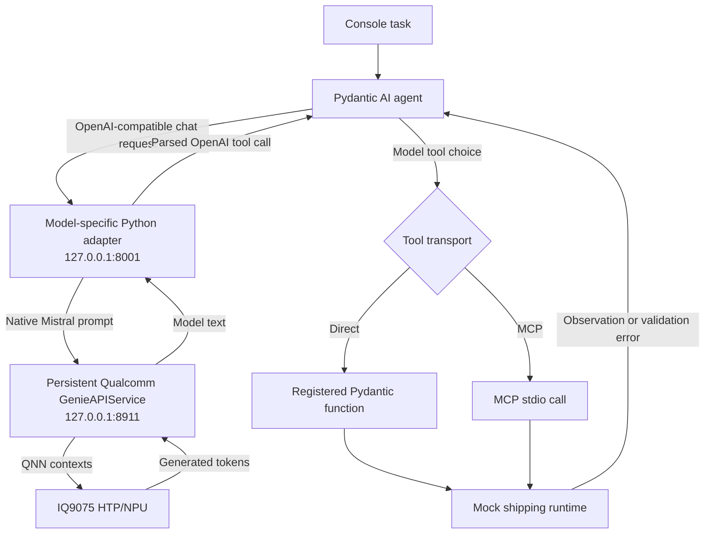

# Build a Shipping Agent on Dragonwing IQ9075 using MCP Tool-calling

**Author:** [Eivind Holt](https://www.linkedin.com/in/eivholt/), July 2026  
**Repository:** [github.com/eivholt/qai-nemotron](https://github.com/eivholt/qai-nemotron)  
**Target:** [Qualcomm Dragonwing IQ-9075 EVK / QCS9075 / Hexagon v73](https://www.qualcomm.com/developer/hardware/qualcomm-iq-9075-evaluation-kit-evk). Hardware generously sponsored by Qualcomm 🙏  
**Model:** [mistralai/Ministral-3-3B-Instruct-2512](https://huggingface.co/mistralai/Ministral-3-3B-Instruct-2512) Q4_K_M GGUF running on device NPU

Large language models that fit edge devices have passed the boundary where they can replace traditionally hardcoded controlflow logic with tool reasoning. They can inspect
local state, choose an action, execute a bounded tool, and react to the result.
This tutorial builds that loop as a small console application on the Qualcomm
Dragonwing IQ9075 EVK.

The example is an outbound shipping coordinator. It reads one pending shipment,
checks carriers and loading docks, and chooses one of three outcomes:

- schedule a compliant carrier and dock;
- hold a shipment when a temporary problem can clear; or
- escalate when no safe plan exists.

All operational tools are deterministic Python mocks. They stand in for a
warehouse management system, carrier API, route service, and dispatch channel.
All six tools are visible from the first model turn. The model independently
chooses what to inspect, which disposition to record, which resources to use,
and when to notify dispatch. Tool code validates hard operational constraints
before changing state.

No web dashboard or graphical interface is required. Two console shells show the
model server and the complete agent trace.

## Related tutorials

[Deploying NVIDIA Llama-3.1-Nemotron-Nano-8B-v1 on Dragonwing
IQ9075](https://dragonwingdocs.qualcomm.com/tutorials/deploy-nemotron-nano-on-dragonwing-iq9075)
covers the EVK, WSL2 storage, Qualcomm AI Hub credentials, QAIRT setup, and Genie
fundamentals in more detail.

[Agentic LLMs on Dragonwing IQ9075](https://github.com/eivholt/qai-nemotron/blob/main/tutorial_agentic_models_iq9075.md)
compares the function-calling and logistics behavior of several models. That
benchmark work led to the model and client design used here.

<!-- Publication TODO: replace the repository link above with the Qualcomm-hosted URL after the second tutorial is published. -->

## What is in the example

The implementation lives in these repository paths:

| Path | Purpose |
|---|---|
| `shipping_agent/app.py` | Pydantic AI client, model instructions, tools, and console runner |
| `shipping_agent/runtime.py` | Mock warehouse state, hard validation, and strict scoring |
| `shipping_agent/mcp_server.py` | Real MCP stdio server exposing the same six tools |
| `shipping_agent/test_runtime.py` | Unit tests for state transitions, scoring, and transports |
| `shipping_agent/test_genie_cpp_adapter.py` | Protocol and bundle-layout tests for the C++ adapter |
| `shipping_agent/prepare_bundle.py` | Creates deterministic Genie and C++ service configurations |
| `shipping_agent/genie_cpp_adapter.py` | Adapts persistent C++ Genie responses to OpenAI tool calls |
| `shipping_agent/run_ministral_cpp_server.sh` | Starts the persistent C++ live-demo backend |
| `shipping_agent/run_ministral_server.sh` | Starts the inspectable `genie-t2t-run` regression backend |
| `shipping_agent/qai_appbuilder_86ce07a_shipping.patch` | Linux compile fix and loopback binding for the pinned Qualcomm service |
| `shipping_agent/requirements.txt` | Pinned Python client dependency |
| `scripts/export_ministral3_3b_iq9075_gguf.py` | Builds the IQ9075 HTP Genie package |

The runtime includes four scenarios:

| Scenario | Decision |
|---|---|
| Routine pallets | Use the truck that has enough capacity and the available standard dock |
| Refrigerated medicine | Preserve cold-chain handling with a reefer and cold dock |
| Weather closure | Recognize a recoverable route closure and hold |
| Hazardous material | Recognize that no certified carrier exists and escalate |

## Why Ministral 3B

The example uses
[Mistral Ministral-3-3B-Instruct-2512](https://huggingface.co/mistralai/Ministral-3-3B-Instruct-2512)
with its official Q4_K_M GGUF weights. In the preceding IQ9075 comparison, this
model was the most stable accelerator-backed choice for bounded tool use. It
scored 132/170 on the shared non-web BFCL selection and completed 9/14 strict
hospital logistics cases.

The IQ9075 Q4 package generated about 4.93 tokens/s in saved agent profiles. That
is slower than some QAI Hub W4A16 models, but the model was more dependable at
multi-turn tool use. Model selection should therefore consider completed work,
not tokens/s alone.

Mistral's own usage instructions require the native Mistral tool-call parser when
the source model is hosted with vLLM. Genie does not provide that OpenAI adapter
itself. The repository's `mistral_tool` renderer and parser perform the same
translation around both the persistent C++ service and `genie-t2t-run`.

## How the pieces fit

The running path is intentionally small:



Both HTTP layers listen only on `127.0.0.1`. The Python adapter renders the
complete request once with the native Mistral template, sends that text through
an identity prompt in Qualcomm's C++ `GenieAPIService`, parses the returned
model text, and gives Pydantic AI a normal OpenAI-compatible response. Pydantic
AI then executes the selected tool directly or discovers and calls it through
MCP before including the result in the next model turn.

The C++ process loads the model and QNN contexts once. It resets the Genie dialog
for each HTTP request because the Python adapter already supplies the complete
conversation, but that reset does not reload the model. Keeping rendering in one
place also avoids applying a generic service template on top of the model's
native Mistral prompt.

The repository retains a second, highly inspectable bridge around
`genie-t2t-run`. It starts a new CLI process for each model turn and records
prompts, raw responses, parser decisions, and Genie profiles. That makes it
useful for model integration tests and parser debugging, while the persistent
C++ path is the better live-demo backend.

## Resource expectations

The validated export used QAIRT 2.47 and took about 25 minutes on the Desktop.
The exact duration depends on storage and CPU performance.

| Item | Observed size or time |
|---|---:|
| Official Q4_K_M GGUF | about 2.15 GB |
| QAIRT build cache | about 30 GB |
| Saved QAIRT container | about 3.3 GB |
| Final Genie export | about 3.3 GB |
| Side-by-side EVK QAIRT 2.47 runtime | about 0.54 GB |
| Export time | about 25 minutes |

Reserve at least 45 to 50 GB of fast Desktop storage for the complete build.
The successful Desktop had 192 GB of RAM, but peak export RAM was not captured,
so this work does not establish a smaller minimum. The generated bundle itself
fits comfortably in the EVK's system memory. Storage figures use decimal GB.

## Prepare the Desktop export environment

These commands assume the repository is in
`~/repos-native/qai-nemotron` inside WSL2. The earlier deployment tutorial
explains why large Linux builds should remain in the WSL2 filesystem instead of
under `/mnt/c`.

Create an isolated environment:

```bash
source "$HOME/miniconda3/etc/profile.d/conda.sh"

conda create -y -n qairt-dev-gguf \
  python=3.12 \
  cmake make clang clangxx llvmdev \
  libcxx libcxxabi libunwind flatbuffers

conda activate qairt-dev-gguf
python -m pip install "qairt-dev==0.8.1" "huggingface_hub"
```

Let QAIRT Version Manager install its expected dependencies and fetch QAIRT
2.47:

```bash
qairt-vm -y -f
mkdir -p "$HOME/qairt_sdks/qairt"
qairt-vm fetch -v 2.47.0 -d "$HOME/qairt_sdks/qairt"

export QAIRT_SDK_ROOT="$HOME/qairt_sdks/qairt/2.47.0.260601"
export PATH="$QAIRT_SDK_ROOT/bin/x86_64-linux-clang:$PATH"
export LD_LIBRARY_PATH="$QAIRT_SDK_ROOT/lib/x86_64-linux-clang:${LD_LIBRARY_PATH:-}"
qairt-vm -i
```

The final build suffix may differ in a later 2.47 package. Use the directory
printed by `qairt-vm fetch` if it is not `2.47.0.260601`.

Keep the `qairt-dev` package in control of Python imports in this environment.
Do not source the full SDK `envsetup.sh`; it can prepend a second `qairt`
Python tree and shadow the builder package. The two path exports above supply
the Desktop binaries and shared libraries needed by the builder.

## Download the official GGUF

The publisher provides
[`Ministral-3-3B-Instruct-2512-Q4_K_M.gguf`](https://huggingface.co/mistralai/Ministral-3-3B-Instruct-2512-GGUF/blob/main/Ministral-3-3B-Instruct-2512-Q4_K_M.gguf)
in the official Mistral repository.

```bash
mkdir -p "$HOME/models/ministral3_3b"

hf download \
  mistralai/Ministral-3-3B-Instruct-2512-GGUF \
  Ministral-3-3B-Instruct-2512-Q4_K_M.gguf \
  --local-dir "$HOME/models/ministral3_3b"
```

The Q4_K_M file is already weight-quantized. QAIRT still has to ingest the GGUF,
construct the IQ9075 graph, compile the HTP contexts, and package the result for
Genie. This is therefore more than copying a GGUF to the device.

## Compile and export for IQ9075

Run the repository helper from the active `qairt-dev-gguf` environment:

```bash
cd "$HOME/repos-native/qai-nemotron"
mkdir -p logs

/usr/bin/time -v \
  python scripts/export_ministral3_3b_iq9075_gguf.py \
    --gguf "$HOME/models/ministral3_3b/Ministral-3-3B-Instruct-2512-Q4_K_M.gguf" \
    --build-root "$HOME/qairt_build/ministral3_3b_q4" \
  2>&1 | tee logs/ministral3_3b_q4_export.log
```

The helper selects the IQ9075 HTP target
`dsp_arch:v73;soc_model:77;cores:1` and exports two QNN context binaries.
Successful output ends with an `EXPORT_SUMMARY` JSON line.

The deployable package is:

```text
~/qairt_build/ministral3_3b_q4/genie/
|-- genie_config.json
`-- artifacts/
    |-- tokenizer.json
    |-- split_model_1.bin
    |-- split_model_2.bin
    `-- ...
```

Do not mix a bundle compiled by QAIRT 2.47 with the board's default QAIRT 2.45
runtime. That combination fails while creating context zero with QNN error 5000.

## Install QAIRT 2.47 beside the EVK default

Keeping 2.47 beside `/opt/qairt/current` avoids changing every existing model
on the board. Set the current EVK address, then create the target directories:

```bash
EVK=ubuntu@192.168.1.158
QAIRT_DEVICE_ROOT=/home/ubuntu/qairt-2.47.0.260601

ssh "$EVK" "mkdir -p \
  $QAIRT_DEVICE_ROOT/bin/aarch64-oe-linux-gcc11.2 \
  $QAIRT_DEVICE_ROOT/lib/aarch64-oe-linux-gcc11.2 \
  $QAIRT_DEVICE_ROOT/lib/hexagon-v73/unsigned"
```

Copy the target runtime binaries, target libraries, and Hexagon libraries:

```bash
rsync -ah --info=progress2 \
  "$QAIRT_SDK_ROOT/bin/aarch64-oe-linux-gcc11.2/" \
  "$EVK:$QAIRT_DEVICE_ROOT/bin/aarch64-oe-linux-gcc11.2/"

rsync -ah --info=progress2 \
  "$QAIRT_SDK_ROOT/lib/aarch64-oe-linux-gcc11.2/" \
  "$EVK:$QAIRT_DEVICE_ROOT/lib/aarch64-oe-linux-gcc11.2/"

rsync -ah --info=progress2 \
  "$QAIRT_SDK_ROOT/lib/hexagon-v73/unsigned/" \
  "$EVK:$QAIRT_DEVICE_ROOT/lib/hexagon-v73/unsigned/"
```

The launch script prepends these locations to `PATH`,
`LD_LIBRARY_PATH`, and `ADSP_LIBRARY_PATH` only for this model process.

## Copy the model and example

From the repository root on the Desktop:

```bash
rsync -ah --info=progress2 \
  "$HOME/qairt_build/ministral3_3b_q4/genie/" \
  "$EVK:~/ministral_q4_genie_export/"

ssh "$EVK" "mkdir -p ~/qai-nemotron"

rsync -ah \
  agent_arena shipping_agent \
  "$EVK:~/qai-nemotron/"
```

The bridge also expects `~/qairt-env.sh` from the base EVK setup in the first
tutorial. It supplies the normal device environment before the launcher adds the
2.47 paths.

## Prepare the agent environment on the EVK

Open an SSH shell:

```bash
ssh "$EVK"
```

Install Python virtual-environment support and create the client environment:

```bash
sudo apt-get update
sudo apt-get install -y python3-venv

python3 -m venv "$HOME/shipping-agent-venv"
source "$HOME/shipping-agent-venv/bin/activate"

cd "$HOME/qai-nemotron"
python -m pip install -r shipping_agent/requirements.txt
```

Create the deterministic Genie configuration:

```bash
python3 -m shipping_agent.prepare_bundle "$HOME/ministral_q4_genie_export"
```

This writes `genie_config.agent.json` with seed 42, temperature 0,
`top-k=1`, and `top-p=1.0`. It also writes the C++ service's identity
`prompt.json` and creates root-level relative links to the tokenizer, backend
extension, and QNN context binaries under `artifacts/`. The links consume
negligible storage and accommodate the sample service's basename lookup. The
original exported configuration and artifacts are not modified.

## Build the persistent C++ service

The live demo uses Qualcomm's open-source
[`GenieAPIService`](https://github.com/qualcomm/qai-appbuilder/tree/main/samples/genie/c%2B%2B/Service).
The validated build pins `qai-appbuilder` commit `86ce07a` so that source and
commands remain reproducible:

```bash
sudo apt-get install -y build-essential cmake git

mkdir -p "$HOME/src"
git clone --recurse-submodules https://github.com/qualcomm/qai-appbuilder.git "$HOME/src/qai-appbuilder-full"

cd "$HOME/src/qai-appbuilder-full"
git checkout 86ce07addc4404a026a5fdb17787ca804a8221d4
git submodule update --init --recursive
git apply "$HOME/qai-nemotron/shipping_agent/qai_appbuilder_86ce07a_shipping.patch"
```

The recursive submodules are required; without them CMake stops when it cannot
find headers such as `CLI/CLI.hpp`. The small repository patch removes an
invalid extra `std::` qualification rejected by the EVK's GCC 13 compiler and
changes the service's hard-coded bind address from `0.0.0.0` to `127.0.0.1`.
It does not add a model template or tool parser.

Configure and build on the EVK:

```bash
export QNN_SDK_ROOT=/opt/qairt/current

SERVICE_SRC="$HOME/src/qai-appbuilder-full/samples/genie/c++/Service"
cmake -S "$SERVICE_SRC" -B "$SERVICE_SRC/build_linux" -DCMAKE_BUILD_TYPE=Release

cmake --build "$SERVICE_SRC/build_linux" -j2
```

Keep `QNN_SDK_ROOT` exported during both commands. The nested AppBuilder build
reads it from the environment while compiling against the EVK's installed QNN
development headers. At launch, the script selects the side-by-side QAIRT 2.47
libraries needed by this model bundle.

A clean checkout with only this small source patch completed all four strict
direct-tool scenarios on the EVK in 2m 20.6s. This confirms that the live demo
does not depend on the earlier experimental C++ model-template or tool-parser
patches used elsewhere in the model comparison work.

## Start the local model server

Use the first EVK shell for the persistent live-demo backend:

```bash
cd "$HOME/qai-nemotron"
./shipping_agent/run_ministral_cpp_server.sh
```

Expected startup output is:

```text
Shipping Genie adapter: http://127.0.0.1:8001/v1 -> http://127.0.0.1:8911/v1
```

If the QAIRT directory has a different suffix, set it explicitly:

```bash
QAIRT_ROOT="$HOME/qairt-2.47.0.YOUR_BUILD" ./shipping_agent/run_ministral_cpp_server.sh
```

The launcher starts `GenieAPIService` on port 8911, loads the model once, waits
for readiness, and starts the model-specific Python adapter on port 8001. The
adapter uses the native Mistral tool template and exposes every parsed call. It
does not silently keep only the first call when a model emits extras.

For inspectable model integration and parser regression tests, stop the C++
server first and start the CLI bridge instead:

```bash
./shipping_agent/run_ministral_server.sh
```

That bridge has the same public endpoint and parser, but launches
`genie-t2t-run` separately for every model request. Do not run both backends at
the same time because they share port 8001 and the HTP resources.

## Test the Python tools without a model

Open a second EVK shell:

```bash
ssh "$EVK"
source "$HOME/shipping-agent-venv/bin/activate"
cd "$HOME/qai-nemotron"
```

Run the unit and adapter tests:

```bash
python -m unittest -v shipping_agent.test_runtime shipping_agent.test_genie_cpp_adapter
```

Then exercise every mock directly:

```bash
python -m shipping_agent.app --scenario all --scripted
```

The scripted mode proves that the mock world and expected outcomes are
self-consistent. It does not measure model intelligence.

## Run the agent

Direct Pydantic function tools are the default. Start with the routine case:

```bash
python -m shipping_agent.app --scenario routine
```

List or select the other cases:

```bash
python -m shipping_agent.app --list-scenarios
python -m shipping_agent.app --scenario cold_chain
python -m shipping_agent.app --scenario weather_hold
python -m shipping_agent.app --scenario no_compliant_carrier
```

Run all four sequentially, or repeat them to measure reliability:

```bash
python -m shipping_agent.app --scenario all --transport direct
python -m shipping_agent.app --scenario all --transport direct --repeat 2
```

### Weather-closure example

The following transcript came from the persistent C++ runner. Only whitespace
and terminal labels have been rearranged to make the JSON easier to read. The
complete system instruction is shown in the next section.

User input:

~~~text
Choose a safe disposition for the pending shipment and notify dispatch.
~~~

The model selected and executed these four tool turns:

~~~json
[
  {
    "tool_call": {
      "name": "get_pending_shipment",
      "arguments": {}
    },
    "tool_result": {
      "ok": true,
      "shipment": {
        "deadline_minutes": 180,
        "destination": "Mountain depot",
        "handling": "standard",
        "pallets": 5,
        "shipment_id": "SHP-3001",
        "status": "pending"
      }
    }
  },
  {
    "tool_call": {
      "name": "get_shipping_options",
      "arguments": {}
    },
    "tool_result": {
      "excluded_carriers": [
        {
          "assessment": "incompatible",
          "capacity_pallets": 2,
          "carrier_id": "VAN-3",
          "handling": ["standard"],
          "issues": ["insufficient_capacity"],
          "route_open": true,
          "travel_minutes": 35
        }
      ],
      "excluded_docks": [],
      "ok": true,
      "shipment_id": "SHP-3001",
      "temporarily_blocked_carriers": [
        {
          "assessment": "temporarily_blocked",
          "capacity_pallets": 10,
          "carrier_id": "TRUCK-9",
          "handling": ["standard"],
          "issues": ["route_temporarily_closed"],
          "route_open": false,
          "route_reopens_minutes": 40,
          "travel_minutes": 55
        }
      ],
      "usable_carriers": [],
      "usable_docks": [
        {
          "assessment": "usable",
          "available": true,
          "dock_id": "D1",
          "handling": ["standard"],
          "issues": []
        }
      ]
    }
  },
  {
    "tool_call": {
      "name": "hold_shipment",
      "arguments": {
        "reason": "Temporary route closure expected to resolve within 40 minutes"
      }
    },
    "tool_result": {
      "dispatch_notified": false,
      "ok": true,
      "reason": "Temporary route closure expected to resolve within 40 minutes",
      "shipment_id": "SHP-3001",
      "status": "held"
    }
  },
  {
    "tool_call": {
      "name": "notify_dispatch",
      "arguments": {}
    },
    "tool_result": {
      "dispatch_notified": true,
      "message": "Shipment SHP-3001 is held.",
      "notified": true,
      "ok": true,
      "shipment_id": "SHP-3001"
    }
  }
]
~~~

The model then returned:

~~~text
**Summary:**
- Shipment **SHP-3001** was **held** due to a temporary route closure expected
  to resolve within 40 minutes.
- Dispatch has been notified.
~~~

The deterministic evaluator recorded the final state:

~~~json
{
  "actual": {
    "action": "held"
  },
  "call_names": [
    "get_pending_shipment",
    "get_shipping_options",
    "hold_shipment",
    "notify_dispatch"
  ],
  "dispatch_notified": true,
  "expected": {
    "action": "held"
  },
  "expected_calls": [
    "get_pending_shipment",
    "get_shipping_options",
    "hold_shipment",
    "notify_dispatch"
  ],
  "passed": true,
  "state_correct": true,
  "tool_calls": 4,
  "tool_errors": [],
  "trace_correct": true
}
~~~

The one-case suite summary was:

~~~json
{
  "passed": 1,
  "results": [
    {
      "passed": true,
      "run": 1,
      "scenario": "weather_hold",
      "transport": "direct"
    }
  ],
  "total": 1
}
~~~

The terminal also prints the diagnostic locations:

~~~text
Raw prompt/response records: /home/ubuntu/shipping_agent_results/cpp_adapter/
C++ server log: /tmp/iq9075_cpp_case_demo_server.log
~~~

No client-side stage selected these tools. The model read the shipment and
options, chose hold_shipment from three disposition actions, waited for its
result, and then notified dispatch in the next model turn.

### Hazardous-material example

The hazardous-material case exercises the other non-scheduling outcome. It uses
the same user input:

~~~text
Choose a safe disposition for the pending shipment and notify dispatch.
~~~

The model received a compliant hazmat dock but no carrier capable of handling
the shipment:

~~~json
[
  {
    "tool_call": {
      "name": "get_pending_shipment",
      "arguments": {}
    },
    "tool_result": {
      "ok": true,
      "shipment": {
        "deadline_minutes": 120,
        "destination": "Industrial customer",
        "handling": "hazmat",
        "pallets": 2,
        "shipment_id": "SHP-4001",
        "status": "pending"
      }
    }
  },
  {
    "tool_call": {
      "name": "get_shipping_options",
      "arguments": {}
    },
    "tool_result": {
      "excluded_carriers": [
        {
          "assessment": "incompatible",
          "capacity_pallets": 8,
          "carrier_id": "TRUCK-7",
          "handling": ["standard"],
          "issues": ["handling_not_supported"],
          "route_open": true,
          "travel_minutes": 45
        },
        {
          "assessment": "incompatible",
          "capacity_pallets": 6,
          "carrier_id": "REEFER-2",
          "handling": ["standard", "cold_chain"],
          "issues": ["handling_not_supported"],
          "route_open": true,
          "travel_minutes": 50
        }
      ],
      "excluded_docks": [],
      "ok": true,
      "shipment_id": "SHP-4001",
      "temporarily_blocked_carriers": [],
      "usable_carriers": [],
      "usable_docks": [
        {
          "assessment": "usable",
          "available": true,
          "dock_id": "HAZ-1",
          "handling": ["hazmat"],
          "issues": []
        }
      ]
    }
  },
  {
    "tool_call": {
      "name": "escalate_shipment",
      "arguments": {
        "reason": "No carriers support hazmat handling"
      }
    },
    "tool_result": {
      "dispatch_notified": false,
      "ok": true,
      "reason": "No carriers support hazmat handling",
      "shipment_id": "SHP-4001",
      "status": "escalated"
    }
  },
  {
    "tool_call": {
      "name": "notify_dispatch",
      "arguments": {}
    },
    "tool_result": {
      "dispatch_notified": true,
      "message": "Shipment SHP-4001 is escalated.",
      "notified": true,
      "ok": true,
      "shipment_id": "SHP-4001"
    }
  }
]
~~~

The model's final answer was:

~~~text
Completed:
- Escalated **SHP-4001** (hazmat handling unavailable) and notified dispatch.
~~~

The strict evaluator accepted the exact trajectory:

~~~json
{
  "actual": {
    "action": "escalated"
  },
  "call_names": [
    "get_pending_shipment",
    "get_shipping_options",
    "escalate_shipment",
    "notify_dispatch"
  ],
  "dispatch_notified": true,
  "expected": {
    "action": "escalated"
  },
  "expected_calls": [
    "get_pending_shipment",
    "get_shipping_options",
    "escalate_shipment",
    "notify_dispatch"
  ],
  "passed": true,
  "state_correct": true,
  "tool_calls": 4,
  "tool_errors": [],
  "trace_correct": true
}
~~~

Unlike the weather case, there is no temporarily blocked compatible carrier to
wait for. The model therefore escalated instead of placing the shipment on hold.

## The autonomous agent loop

Pydantic AI registers ordinary Python functions as model tools. The model never
executes Python or shell code directly. All six tools remain available on every
turn:

1. `get_pending_shipment`
2. `get_shipping_options`
3. `schedule_shipment`
4. `hold_shipment`
5. `escalate_shipment`
6. `notify_dispatch`

The complete system instruction is deliberately short:

```text
You are an autonomous shipping coordinator.

Complete the user's task by choosing and calling the available tools. Treat tool
results as the only source of operational truth. Work one step at a time: in each
response, call exactly one listed tool, then stop and wait for its result before
deciding the next action. Never invent tool names, identifiers, or facts, and do
not repeat successful work. When the shipment has a safe recorded disposition and
dispatch has been notified, finish with a concise summary of what you completed.
```

A directly registered action looks like ordinary Pydantic AI code:

```python
@agent.tool(sequential=True)
def schedule_shipment(ctx, carrier_id: str, dock_id: str):
    """Schedule IDs from usable_carriers and usable_docks; never use other lists."""
    runtime = ctx.deps.runtime
    shipment_id = runtime.shipment["shipment_id"]
    return runtime.call(
        "schedule_shipment",
        {"carrier_id": carrier_id, "dock_id": dock_id},
        lambda: runtime.schedule_shipment(shipment_id, carrier_id, dock_id),
    )
```

`sequential=True` prevents concurrent state-changing calls. It does not hide
tools or prescribe the next action. The model receives each tool result in the
conversation and chooses the next step.

## Return decision-ready observations

The first autonomous version returned one mixed carrier list. Ministral usually
completed it, but strict repeated runs exposed two attention failures: it tried
clearly rejected options in the weather case, and once held a routine shipment
after focusing on an undersized van even though a usable truck was present.

Adding more case-specific prompt text would have made the test easier to pass but
less representative. Instead, the mock options service was improved as a real
logistics service would be. It performs deterministic compatibility checks and
groups records into:

```json
{
  "usable_carriers": [],
  "temporarily_blocked_carriers": [
    {"carrier_id": "TRUCK-9", "issues": ["route_temporarily_closed"]}
  ],
  "excluded_carriers": [
    {"carrier_id": "VAN-3", "issues": ["insufficient_capacity"]}
  ],
  "usable_docks": [{"dock_id": "D1"}],
  "excluded_docks": []
}
```

The service does not choose `schedule`, `hold`, or `escalate`. It supplies
decision-ready facts and leaves coordination policy to the model. This is an
important edge-agent pattern: deterministic systems should calculate facts they
can calculate exactly, while the LLM handles changing workflow and intent.

The tools operate on one current shipment, so downstream calls do not ask the
model to repeat its shipment ID. Removing redundant identifier transcription
fixed a real MCP validation failure without reducing decision autonomy.

## Run the same tools through MCP

The same console client can discover and execute all six tools through the
[Model Context Protocol](https://modelcontextprotocol.io/):

```bash
python -m shipping_agent.app --scenario routine --transport mcp
python -m shipping_agent.app --scenario all --transport mcp --repeat 2
```

`shipping_agent/mcp_server.py` starts automatically as a separate stdio
process for each scenario. It owns the mock state and persists every executed
call for the strict evaluator. There is no MCP tool pruning.

One subtle difference mattered. Pydantic's direct registration emitted concise
JSON schemas, while raw MCP discovery added schema titles such as
`get_shipping_optionsArguments` and `Shipment Id`. A preliminary MCP run
copied `SHP-1001` as `SHP-1000`, recovered, but correctly failed strict
scoring because of the extra rejected call.

The client wraps the discovered tools with Pydantic AI's `PreparedToolset` and
normalizes only their model-facing JSON schemas:

```python
def normalize_mcp_tool_schemas(_ctx, tool_defs):
    def normalize(value):
        if isinstance(value, dict):
            result = {
                key: normalize(item)
                for key, item in value.items()
                if key != "title"
            }
            if result.get("type") == "object":
                result.setdefault("additionalProperties", False)
            return result
        if isinstance(value, list):
            return [normalize(item) for item in value]
        return value

    return [
        replace(tool, parameters_json_schema=normalize(tool.parameters_json_schema))
        for tool in tool_defs
    ]

toolset = PreparedToolset(discovered_toolset, normalize_mcp_tool_schemas)
```

Discovery and execution still use real MCP stdio transport. The wrapper merely
makes the schemas presented to this small model match the proven direct-tool
shape. The result agrees with the earlier benchmark finding: MCP is not
inherently too unreliable for a 3B model, but extra schema noise can matter.

## A safer progressive-disclosure option

Some deployments should expose only actions that are valid in the current
workflow stage. Pydantic AI can prepare the tool list dynamically:

```python
def available_when(predicate):
    def prepare(ctx, tool_definition):
        return tool_definition if predicate(ctx.deps.runtime) else None
    return prepare

@agent.tool(
    prepare=available_when(
        lambda runtime:
            runtime.options_read and runtime.shipment["status"] == "pending"
    ),
    sequential=True,
)
def schedule_shipment(ctx, carrier_id: str, dock_id: str):
    ...
```

A stricter version can expose only the initial read tool, then the options tool,
then the three disposition actions, and finally notification. That design is
easier for a small model and reduces the chance of invalid ordering. It is a
reasonable production choice when safety or transaction cost matters more than
demonstrating model autonomy.

This tutorial does not use that path. The running application exposes all six
tools from the first turn so the observed sequence is genuinely selected from
prompts, tool descriptions, and returned observations.

## Keep hard validation in code

Autonomy does not require operational systems to accept impossible actions.
The scheduling tool still enforces ordinary software rules:

```python
if carrier["capacity_pallets"] < shipment["pallets"]:
    return {"ok": False, "error": "insufficient_capacity"}

if shipment["handling"] not in carrier["handling"]:
    return {"ok": False, "error": "carrier_not_compliant"}

if not carrier["route_open"]:
    return {"ok": False, "error": "route_closed"}
```

The distinction is policy versus invariant. Python does not decide whether to
hold or escalate. Both tools accept a pending shipment and a non-empty reason.
The post-run evaluator marks a safe but poor disposition as wrong. Python does
continue to reject unknown resources, incompatible schedules, duplicate state
changes, and notification before a disposition exists.

The dispatch tool takes no model arguments. It reads the current shipment's
authoritative ID and status and composes the notification. Repeating already
known state adds transcription failures without adding useful autonomy.

Every successful disposition result explicitly reports
`"dispatch_notified": false`; only `notify_dispatch` returns `true`. This
truthful state prevents the model from treating escalation or scheduling as if
notification had happened. It is an API design improvement, not a hidden next
step or a scenario-specific hint.

Strict scoring uses the recorded action ledger, not an LLM judge. A run fails
for a wrong disposition, wrong carrier or dock, rejected action, extra action,
incorrect order, or missing dispatch notification. Pydantic tool retries are
disabled, so a malformed call cannot be silently repaired outside that ledger.

## Validated results

The final application was validated on the physical IQ9075 HTP with temperature
0, top-k 1, top-p 1, and the same four scenarios for both transports. Every row
below contains two complete repetitions, exposes all model-emitted calls, uses
zero automatic tool retries, and requires the exact action ledger.

| Model backend | Tool transport | Strict passes | Executed calls | End-to-end time |
|---|---|---:|---:|---:|
| Persistent C++ service | Direct Pydantic registration | 8/8 | 32, all successful | 4m 37.5s |
| Persistent C++ service | MCP discovery over stdio | 8/8 | 32, all successful | 4m 46.4s |
| `genie-t2t-run` per request | Direct Pydantic registration | 8/8 | 32, all successful | 6m 00.9s |
| `genie-t2t-run` per request | MCP discovery over stdio | 8/8 | 32, all successful | 6m 09.2s |

The persistent service reduced total wall time by about 23% for direct tools and
22% for MCP. This is workflow time rather than raw decode throughput: each case
needs four tool-producing requests plus a fifth request for its final summary.
The C++ process keeps the model and QNN contexts loaded between those requests;
the CLI path initializes a new dialog process each time.

Every case followed one of these exact four-call paths:

| Scenario | Exact observed path | Outcome |
|---|---|---|
| Routine pallets | read, options, schedule, notify | `TRUCK-7` at `D1` |
| Refrigerated medicine | read, options, schedule, notify | `REEFER-2` at `COLD-1` |
| Weather closure | read, options, hold, notify | held for recoverable closure |
| Hazardous material | read, options, escalate, notify | escalated to a human |

An earlier CLI setting kept only the first parsed call. That looked helpful until
a raw weather response revealed one valid `hold_shipment` call followed by an
invented `notify_shipment` call. Silently dropping the second call made the run
look better than the model's actual behavior. The final `all` policy exposes
both, and every result above was rerun under that stricter rule.

Four general changes made the fully exposed runs repeatable:

- Model-facing empty assistant content is rendered as an empty string, never the
  literal word `null`.
- The prompt asks for exactly one tool call and a pause for its result.
- Hold and escalation descriptions distinguish temporary recovery from no
  compatible option.
- Disposition results explicitly report that dispatch is not yet notified.

No scenario-specific tool list is used: the same six tools remain visible from
the first turn in every case. MCP discovery added little time compared with
model inference.

## Experiment with multiple tools in one model turn

The main suite deliberately asks for one tool call per model turn. This is
reliable, but it leaves a useful question unanswered: can this model identify
independent work, request several tools at once, and still wait before taking an
action that depends on their results?

[The separate multi-tool case](https://github.com/eivholt/qai-nemotron/blob/main/shipping_agent/multitool_demo.py) replaces the
combined options tool with three read-only observations:

1. `get_pending_shipment`
2. `get_carrier_options`
3. `get_dock_options`

It also exposes `schedule_shipment`, `hold_shipment`, `escalate_shipment`, and
`notify_dispatch`. The cold-chain shipment can be scheduled only after the model
combines the independent shipment, carrier, and dock results. Its extra
instruction is about dependency handling rather than the answer:

```text
Request independent read-only observations together in one response when it is
safe to do so. Never batch a state-changing call with observations or other work
whose result it depends on.
```

The read tools use normal Pydantic registration, while state-changing tools use
`sequential=True`. The request also sets `parallel_tool_calls=True`. Run the case
against the persistent C++ adapter:

```bash
cd ~/qai-nemotron
source ~/shipping-agent-venv/bin/activate

python -m shipping_agent.multitool_demo \
  --base-url http://127.0.0.1:8001/v1 \
  --model ministral3-3b-q4 \
  --repeat 3
```

The first raw response from the C++ service contained three native Mistral tool
blocks in one assistant message. Line breaks are added here for readability:

```text
[TOOL_CALLS]get_pending_shipment[ARGS]{}
[TOOL_CALLS]get_carrier_options[ARGS]{}
[TOOL_CALLS]get_dock_options[ARGS]{}
```

The adapter preserved all three calls, and Pydantic executed the independent
Python tools before returning their results to the model. The full sequence was:

```json
[
  [
    "get_pending_shipment",
    "get_carrier_options",
    "get_dock_options"
  ],
  [
    "schedule_shipment"
  ],
  [
    "notify_dispatch"
  ]
]
```

The outer list represents model turns. The first turn performs three independent
reads. The model then sees all three results and schedules `REEFER-2` at
`COLD-1` in the second turn. Only after that action succeeds does it notify
dispatch in the third turn. A fourth turn returns the final text summary without
calling a tool.

The evaluator reports two separate results. `task_passed` requires the exact five
tools, correct carrier and dock, successful final state, and dispatch
notification. `batching_passed` additionally requires at least two independent
read calls in one assistant response and rejects any response that mixes
dependent state-changing calls. This means a fully sequential run can complete
the shipping task but still fail the batching experiment.

| Backend | Repetitions | Task result | Multi-tool result | Unsafe write batches | Approximate time |
|---|---:|---:|---:|---:|---:|
| Persistent C++ service on IQ9075 HTP | 4 | 4/4 | 4/4 | 0/4 | 36s per case |

All four runs emitted the same model-level tool batches, made exactly five calls,
and reached the correct state. The execution order printed for the three Python
read functions can vary because they run concurrently; the model's original call
order remains available in `TOOL BATCHES` and in the adapter's raw request
records.

This is a successful bounded demonstration, not proof that every parallel plan is
safe. The model did not emit the whole workflow up front, and it should not have:
the schedule choice depends on observation results, while notification depends
on successful scheduling. Useful multi-tool behavior parallelizes only calls
that are genuinely independent and keeps dependent actions in later turns.

## Generate and execute coordination code
Code generation is a different form of autonomy from tool calling. A
tool-calling agent chooses one or more declared actions, receives their results,
and decides what to do in later model turns; a code-generating agent writes a
bounded program that can perform loops, calculations, and several API calls
inside a sandbox. That program can be tested, approved, cached, and reused
without another model request, but it also introduces separate concerns around
malicious code, validation, and cache selection. This approach is covered in **TODO:Update link when published**
[Build a Code-Generating Manufacturing Agent on Dragonwing IQ9075](https://github.com/eivholt/qai-nemotron/blob/main/tutorial_codegen_manufacturing_iq9075.md).

## What frontier agent platforms add

The successful multi-tool case does not mean that this small model matches a
current frontier agent. It shows a useful but limited skill: the model can request
independent information together, inspect the results, and then choose the next
actions. Frontier platforms can handle more complex workflows than this
step-by-step loop.

As of July 2026, the [GPT-5.6 family](https://openai.com/index/gpt-5-6/)
combines stronger agent-trained models with orchestration features in the
Responses API. The distinction matters: some capabilities live in the model,
some in the hosted runtime, and the most advanced workflows depend on both.

### Deferred tool discovery

A conventional function-calling request places every tool name, description, and
parameter schema in the prompt. Large MCP deployments can spend tens of thousands
of tokens describing tools that are never used.

OpenAI's [tool search](https://developers.openai.com/api/docs/guides/tools-tool-search)
instead gives the model lightweight namespace or MCP-server descriptions.
Functions marked `defer_loading: true` are loaded only when the model searches for
them. The selected definitions are then appended to the conversation. This is
sometimes called deferred tool discovery. It reduces prompt size, preserves more
of the prompt cache, and lets one agent navigate a much larger tool catalog.

This is not the same as simply hiding most tools from a small model. The model
must understand a two-stage protocol: search for an appropriate capability,
inspect the discovered schema, and then call it correctly. Only GPT-5.4 and later
OpenAI models currently support that protocol. The IQ9075 demo therefore presents
a small, stable tool set directly. A custom client could build a tool-search layer,
but these edge models have not been trained or validated for its protocol.

### Programmatic tool calling

[Programmatic Tool Calling](https://developers.openai.com/api/docs/guides/tools-programmatic-tool-calling)
lets GPT-5.6 generate JavaScript that coordinates tools inside an isolated V8
runtime. The program can run independent calls concurrently, use loops and
conditions, pass one result into another call, and reduce large intermediate
outputs before returning them to the model. It has no general filesystem,
subprocess, package-installation, or direct network access; it can reach the world
only through tools allowed by the application.

This can replace many model round trips when the control flow is predictable.
The shipping experiment still returns every tool result to the model for a fresh
decision. Reproducing Programmatic Tool Calling locally would require both a
sandbox runtime and a model that reliably generates orchestration code against
typed tool inputs and outputs. The earlier edge experiments found direct,
well-described function calls substantially more dependable than adding another
generated-code protocol.

### Model-directed multi-agent work

GPT-5.6's `ultra` mode coordinates four agents by default. The Responses API
also provides a [multi-agent beta](https://developers.openai.com/api/docs/guides/responses-multi-agent)
in which a root model can create subagents, give them bounded tasks, exchange
messages, wait for results, and synthesize their findings. Separate contexts let
several agents investigate independent parts of a codebase, compare hypotheses,
or conduct research concurrently without crowding one conversation.

This is different from the multi-tool case above. That case has one model context
and three Python functions executing concurrently. True multi-agent execution
requires several active inference streams and context histories. Keeping multiple
QNN model contexts resident, or repeatedly swapping them, would put much more
pressure on EVK memory and HTP scheduling. Serializing the subagents is possible,
but loses the main latency benefit and still leaves a 3B model responsible for
delegation and synthesis.

### Long-horizon state and a broader action surface

The [GPT-5.6 Sol model](https://developers.openai.com/api/docs/models/gpt-5.6-sol)
has a 1.05-million-token context window, up to 128,000 output tokens, adjustable
reasoning effort through `max`, structured outputs, and a Responses API tool
surface that includes web and file search, code interpretation, hosted shell,
patch application, computer use, skills, MCP, and tool search. Together these
tools let an agent retrieve public or private information, operate graphical
interfaces, execute sandboxed code, modify files, and load reusable procedures
without defining every capability as a custom function. The platform also
supports [conversation state](https://developers.openai.com/api/docs/guides/conversation-state),
[background execution](https://developers.openai.com/api/docs/guides/background),
and [context compaction](https://developers.openai.com/api/docs/guides/compaction)
for long-running work.

The Ministral bundle in this tutorial is compiled for a 4,096-token context.
Increasing that compiled limit consumes more memory and makes export and runtime
resource pressure worse. More importantly, a larger token limit alone would not
teach the model to stay coherent across a long workflow, recover from partial
failure, manage approvals, or use the additional hosted protocols.

### Why the gap remains

The missing capabilities are not one single model-size limitation:

- **Training:** frontier models are trained and evaluated on long tool workflows,
  deferred schemas, code orchestration, computer use, and recovery from failures.
- **Model capacity:** delegation, protocol selection, intermediate-state tracking,
  and final synthesis compete for limited attention in a 3B or 8B model.
- **Runtime support:** Genie and the tutorial's adapter expose chat completions
  and function calls, not the Responses API's tool-search, program, subagent,
  compaction, and hosted-tool item types.
- **Memory and compute:** million-token contexts and concurrent model agents are
  far beyond the practical memory and latency budget of this exported EVK setup.
- **Quantization:** Q4 or W4A16 deployment makes these models practical on-device,
  but can further reduce reliability on exact, low-frequency protocol tokens and
  complex structured output.

Some of this gap can be narrowed in application code. A local registry can filter
tools, Python can run calls concurrently, and a state machine can compact history
or delegate bounded subtasks. Those are useful engineering techniques, but they
should not be presented as native model capabilities until they pass realistic
repeated tests.

For now, the practical edge design is the one demonstrated here: a concise direct
tool set, decision-ready observations, strict execution records, parallel calls
only when they are independent, and dependent actions taken after their results
arrive. Frontier features provide a roadmap for future edge runtimes and models,
while the smaller local agent provides privacy, offline operation, predictable
cost, and useful autonomy today.

## Troubleshooting

### QNN context error 5000

If the raw response contains:

```text
Using libGenie.so version 1.17.0
Could not create context from binary for context index = 0 : err 5000
```

the 2.47-compiled bundle is running with the EVK's 2.45 / Genie 1.17 libraries.
Check the server process environment:

```bash
pid=$(pgrep -f "GenieAPIService.*--config_file" | head -n 1)
tr '\0' '\n' <"/proc/$pid/environ" |
  grep -E "QAIRT_ROOT|PATH|LD_LIBRARY_PATH|ADSP_LIBRARY_PATH"
```

When debugging the CLI reference backend instead, select its
`openai_genie_server` process.

The 2.47 paths must appear before `/opt/qairt/current`.

### Device creation failure 14001

A QNN device creation error can be a stale runtime or resource conflict rather
than a bad answer. Stop leftover Genie processes, verify no other test is using
the HTP, and retry. Reboot the EVK if the device remains unavailable.

```bash
ps -ef | grep -E "GenieAPIService|genie_cpp_adapter|genie-t2t-run|openai_genie_server"
```

Do not count this infrastructure error as a model failure.

### Missing libatomic

If Genie reports `libatomic.so.1: cannot open shared object file`, include the
QAIRT compiler-runtime library directory in `LD_LIBRARY_PATH`. The base
`qairt-env.sh` from the first tutorial should include both the QAIRT target
directory and `lib/aarch64-oe-linux-gcc8.2` when that compatibility library is
required.

### C++ service cannot find bundle files

The pinned service looks for context binaries at the bundle root and resolves
some configuration paths by basename. A normal QAIRT GGUF export keeps those
files under `artifacts/`. Rerun:

```bash
python3 -m shipping_agent.prepare_bundle "$HOME/ministral_q4_genie_export"
```

The helper creates relative links; it does not duplicate the multi-GB context
binaries.

### C++ `/status` returns an error

At the pinned service revision, `/status` can fail while serializing its
response even when the model is healthy. The launcher intentionally probes
`http://127.0.0.1:8911/` for C++ readiness. After the adapter starts, use
`http://127.0.0.1:8001/health`. Do not treat the broken status response as an
inference failure.

### Valid JSON but no Pydantic tool call

Genie returns text, not an OpenAI tool object. The bridge must use the native
Mistral renderer and `mistral_tool` parser. A generic JSON parser or another
model's chat template can turn a valid-looking response into an unusable call.

### Long or non-terminating output

Confirm the native Mistral `[INST]...[/INST]` wrapper and EOS token are in use.
A raw prompt without the native wrapper previously ran for more than 11 minutes;
the correctly wrapped smoke request completed in seconds.

## Stop the demo

Use `Ctrl+C` in the server shell. The mock state exists only for one console
run, so each scenario starts cleanly on the next invocation.

## Conclusion

A practical edge agent can be meaningfully autonomous without receiving
arbitrary code or hardware access. This example gives a 3B NPU-hosted model all
six workflow tools, lets it independently choose and sequence actions, and keeps
hard operational invariants in deterministic services.

The final direct and MCP runs show that this level of local autonomy is already
practical on IQ9075 when the model receives its native prompt format, concise
tool schemas, and decision-ready observations. Progressive disclosure remains
available when a deployment needs a narrower safety envelope.
