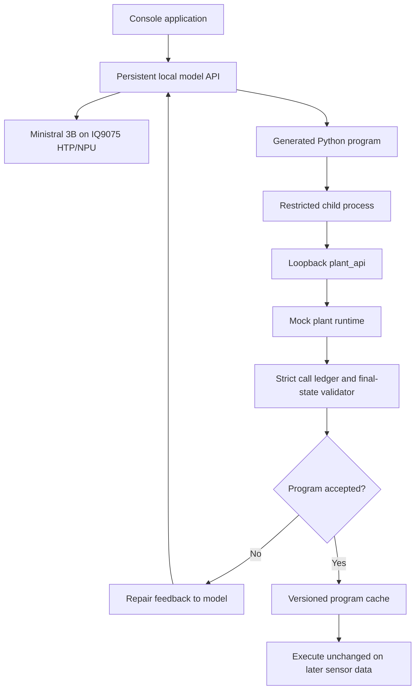

# Build a Code-Generating Agent on Dragonwing IQ9075

**Author:** [Eivind Holt](https://www.linkedin.com/in/eivholt/), June 2026  
**Repository:** [github.com/eivholt/qai-nemotron](https://github.com/eivholt/qai-nemotron)  
**Target:** [Qualcomm Dragonwing IQ-9075 EVK / QCS9075 / Hexagon v73](https://www.qualcomm.com/developer/hardware/qualcomm-iq-9075-evaluation-kit-evk). Hardware generously sponsored by Qualcomm 🙏  
**Model:** [mistralai/Ministral-3-3B-Instruct-2512](https://huggingface.co/mistralai/Ministral-3-3B-Instruct-2512) Q4_K_M GGUF running on device NPU

Function calling asks a language model to choose the next tool. Code generation
asks it to generate a small program that can call several APIs, calculate derived
values, branch on policy. Successful code can be saved and reused when input data changes.

This tutorial demonstrates code generating and -execution AI agents on the Qualcomm Dragonwing IQ9075 EVK.
A local Ministral 3B model generates five different Python programs for mocked
production operations: batch disposition, maintenance priority, quality
sampling, energy scheduling, and spare-parts replenishment. Python executes each
program in a restricted child process, while deterministic mock runtimes record
and validate every API call.

The example is console based. It does not control a machine, safety interlock, or
real-time process.

## Related tutorials

The following tutorials provide the path leading to this example:

1. [Deploying NVIDIA Llama-3.1-Nemotron-Nano-8B-v1 on Dragonwing IQ9075](https://dragonwingdocs.qualcomm.com/tutorials/deploy-nemotron-nano-on-dragonwing-iq9075)
   introduces the EVK, WSL2 storage, Qualcomm AI Hub, QAIRT, and Genie.
2. [Agentic LLMs on Dragonwing IQ9075](tutorial_agentic_models_iq9075.md)
   compares several small models on function calling and logistics benchmarks.
3. [Build a Console Shipping Agent on Dragonwing IQ9075](tutorial_build_agentic_shipping_iq9075.md)
   implements a multi-turn agent with directly registered tools, MCP, and a
   persistent C++ Genie service.

This article repeats the essential export and hosting commands so that the code
generation example can also be followed on its own.

<!-- Publication TODO: replace repository links above with Qualcomm-hosted URLs when those tutorials are published. -->

## Why generate code

A direct tool-calling loop is a good fit when the model should observe one
result and choose one next action. A generated program can be a better fit when
the same calculation and API sequence must be repeated over changing values.

The manufacturing policy in this example requires the program to:

- fetch an active batch, policy thresholds, quality counts, and sensor summaries;
- calculate the defect rate from changing quality counts;
- compare it and the supplied temperature and vibration metrics with policy;
- choose release, hold, or quarantine;
- schedule an inspection before a hold;
- notify the supervisor after the disposition.

In conventional control-flow code, a developer writes every branch. Here, the
model receives the API contract and policy in natural language and writes the
whole coordination program. The surrounding application does not choose the
disposition for it.

This does not make validation optional. Generated code is still untrusted code,
and a plausible-looking program can be wrong.

## Five code-generation tasks

The first batch-disposition task is kept as a compact walkthrough. Four more
tasks test whether code generation works across different data shapes,
calculations, selections, and actions:

| Generated program | Observations and decision | Changing-data cases |
|---|---|---|
| Batch disposition | Compare defect rate and machine summaries; release, hold, or quarantine | Healthy, vibration anomaly, quality spike |
| Maintenance priority | Select the highest-risk machine; monitor, plan service, or mark urgent | Low risk, planned service, critical risk |
| Quality sampling | Aggregate defects and inspect station rework; release, sample, or quarantine | Healthy lot, station rework, total defects |
| Energy window | Select the first price, load, and deadline-compatible window or defer | First window, skip overloaded window, no feasible window |
| Spares replenishment | Calculate shortage and choose the first quantity and lead-time-compatible supplier | Sufficient stock, purchase order, escalation |

These are five separate prompts and five separate cached programs. Each task has
three mock scenarios, giving 15 visible cases. Promotion also executes each new
program across all three cases before it can be cached, so a perfect first run
performs 25 sandbox executions: 15 promotion checks and 10 later cache
revalidations. No live identifiers, measurements, thresholds, or expected
actions appear in generated source prompts. They arrive from the mock APIs when
the program runs.

The suite intentionally returns deterministic sensor summaries instead of raw
waveforms. Maximum temperature and vibration RMS are fixed feature-extraction
work; the generated program handles the supervisory decision and coordination
logic where model flexibility is useful.
## Architecture



The model is involved while generating or repairing the program. A cache hit
does not call the model to revalidate the previously generated code. This matters on an edge device: inference is relatively expensive, while a short validated Python program executes in milliseconds.

## Repository files

| Path | Purpose |
|---|---|
| `manufacturing_agent/app.py` | Original single-policy walkthrough |
| `manufacturing_agent/runtime.py` | Original batch mock state and validator |
| `manufacturing_agent/codegen_tasks.py` | Five task contracts, 15 mock scenarios, APIs, and strict validators |
| `manufacturing_agent/codegen_suite.py` | Generic sandbox runner, model repair, promotion, and cache revalidation |
| `manufacturing_agent/test_app.py` | Original focused walkthrough tests |
| `manufacturing_agent/test_codegen_suite.py` | Five-task, sandbox, promotion, and cache tests |
| `shipping_agent/run_ministral_cpp_server.sh` | Persistent IQ9075 model launcher reused from the shipping tutorial |
| `shipping_agent/genie_cpp_adapter.py` | Native Mistral prompt renderer and OpenAI-compatible adapter |
| `scripts/export_ministral3_3b_iq9075_gguf.py` | GGUF-to-Genie export helper |


## Model choice

The example uses
[Ministral-3-3B-Instruct-2512](https://huggingface.co/mistralai/Ministral-3-3B-Instruct-2512)
and the publisher's Q4_K_M GGUF. In the preceding comparison, it was the most
reliable accelerator-backed model for the bounded agentic workloads tested on
IQ9075.

The exported model runs through Qualcomm Genie and QNN on the IQ9075 HTP/NPU.
It is not a llama.cpp CPU fallback. Saved agent profiles produced about 4.93
generated tokens/s. Once a program has been accepted, cached execution does not
incur that token-generation cost.

## Desktop export environment

Keep the repository and build directories in the WSL2 Linux filesystem. The
first tutorial explains the storage setup in more detail.

```bash
source "$HOME/miniconda3/etc/profile.d/conda.sh"

conda create -y -n qairt-dev-gguf \
  python=3.12 \
  cmake make clang clangxx llvmdev \
  libcxx libcxxabi libunwind flatbuffers

conda activate qairt-dev-gguf
python -m pip install "qairt-dev==0.8.1" "huggingface_hub"

qairt-vm -y -f
mkdir -p "$HOME/qairt_sdks/qairt"
qairt-vm fetch -v 2.47.0 -d "$HOME/qairt_sdks/qairt"

export QAIRT_SDK_ROOT="$HOME/qairt_sdks/qairt/2.47.0.260601"
export PATH="$QAIRT_SDK_ROOT/bin/x86_64-linux-clang:$PATH"
export LD_LIBRARY_PATH="$QAIRT_SDK_ROOT/lib/x86_64-linux-clang:$LD_LIBRARY_PATH"
qairt-vm -i
```

Use the exact directory printed by `qairt-vm fetch` if the package suffix has
changed. Do not source the full SDK `envsetup.sh` in this environment because
its second Python tree can shadow the `qairt-dev` builder package.

## Download and export Ministral

Download the official quantized file:

```bash
mkdir -p "$HOME/models/ministral3_3b"

hf download \
  mistralai/Ministral-3-3B-Instruct-2512-GGUF \
  Ministral-3-3B-Instruct-2512-Q4_K_M.gguf \
  --local-dir "$HOME/models/ministral3_3b"
```

Compile the HTP contexts and build a Genie bundle:

```bash
cd "$HOME/repos-native/qai-nemotron"
mkdir -p logs

/usr/bin/time -v \
  python scripts/export_ministral3_3b_iq9075_gguf.py \
    --gguf "$HOME/models/ministral3_3b/Ministral-3-3B-Instruct-2512-Q4_K_M.gguf" \
    --build-root "$HOME/qairt_build/ministral3_3b_q4" \
  2>&1 | tee logs/ministral3_3b_q4_export.log
```

The validated export used QAIRT 2.47 and took about 25 minutes on the Desktop.
Allow roughly 45 to 50 GB of fast working storage. The final Genie package is
about 3.3 GB; the original GGUF is about 2.15 GB. The preceding shipping tutorial
contains the fuller resource table and export troubleshooting.

## Match the EVK runtime

A model compiled with QAIRT 2.47 must use matching 2.47 target and Hexagon
libraries. Keep them beside the board's default QAIRT installation:

```bash
EVK=ubuntu@192.168.1.158
QAIRT_DEVICE_ROOT=/home/ubuntu/qairt-2.47.0.260601

ssh "$EVK" "mkdir -p \
  $QAIRT_DEVICE_ROOT/bin/aarch64-oe-linux-gcc11.2 \
  $QAIRT_DEVICE_ROOT/lib/aarch64-oe-linux-gcc11.2 \
  $QAIRT_DEVICE_ROOT/lib/hexagon-v73/unsigned"

rsync -ah --info=progress2 \
  "$QAIRT_SDK_ROOT/bin/aarch64-oe-linux-gcc11.2/" \
  "$EVK:$QAIRT_DEVICE_ROOT/bin/aarch64-oe-linux-gcc11.2/"

rsync -ah --info=progress2 \
  "$QAIRT_SDK_ROOT/lib/aarch64-oe-linux-gcc11.2/" \
  "$EVK:$QAIRT_DEVICE_ROOT/lib/aarch64-oe-linux-gcc11.2/"

rsync -ah --info=progress2 \
  "$QAIRT_SDK_ROOT/lib/hexagon-v73/unsigned/" \
  "$EVK:$QAIRT_DEVICE_ROOT/lib/hexagon-v73/unsigned/"
```

Mixing the 2.47 bundle with the default 2.45 runtime causes QNN context creation
error 5000. Side-by-side installation avoids breaking models that still require
the board's original runtime.

## Copy and prepare

```bash
rsync -ah --info=progress2 \
  "$HOME/qairt_build/ministral3_3b_q4/genie/" \
  "$EVK:~/ministral_q4_genie_export/"

ssh "$EVK" "mkdir -p ~/qai-nemotron"

rsync -ah \
  agent_arena shipping_agent manufacturing_agent \
  "$EVK:~/qai-nemotron/"
```

The launcher expects `~/qairt-env.sh` from the first tutorial.

Prepare the bundle and test the application:

```bash
ssh "$EVK"
cd "$HOME/qai-nemotron"

python3 -m shipping_agent.prepare_bundle "$HOME/ministral_q4_genie_export"
python3 -m unittest   manufacturing_agent.test_app   manufacturing_agent.test_codegen_suite
```

The tests execute a handwritten reference policy across all four scenarios,
verify strict rejection of extra calls, check repair feedback, and confirm that
external sockets and subprocesses are blocked in the development sandbox.

## Start the persistent model service

Build the C++ service once by following
[the persistent service section in the shipping tutorial](tutorial_build_agentic_shipping_iq9075.md#build-the-persistent-c-service).
That section pins the tested `qai-appbuilder` commit and includes the small EVK
compile and loopback-binding patch.

Start the service in the first EVK shell:

```bash
cd "$HOME/qai-nemotron"
./shipping_agent/run_ministral_cpp_server.sh
```

The launcher loads the model once, starts Qualcomm's `GenieAPIService` on
`127.0.0.1:8911`, and exposes an OpenAI-compatible endpoint on
`127.0.0.1:8001`. The adapter applies Ministral's native chat template and
end-of-sequence behavior.

## Generate a program

Open a second EVK shell:

```bash
ssh "$EVK"
cd "$HOME/qai-nemotron"

python3 -m manufacturing_agent.app \
  --base-url http://127.0.0.1:8001/v1 \
  --model ministral3-3b-q4 \
  --label manufacturing-demo \
  --scenario normal \
  --reuse-policy execute_first \
  --repair-retries 2
```

The label selects a cache namespace. Use a new label to force a genuinely fresh
generation. The application prints the generated source, execution result,
strict API ledger, and result directory.

The model's contract is deliberately explicit about interfaces and invariants,
but it contains no live case values:

```text
First collect every machine summary without taking any action. Store each
complete summary dict. After the read loop, choose exactly one disposition for
the batch. When holding, inspect the first stored summary whose
max_temperature_c or vibration_rms exceeds its matching policy limit. Notify
the supervisor after every successful disposition.
```

This is API and policy documentation, not answer padding. A human developer
would need the same ordering rule because acting before all required observations
have been collected is invalid in this mock plant.

## Validate changing inputs

Run all four scenarios with the same label:

```bash
python3 -m manufacturing_agent.app \
  --base-url http://127.0.0.1:8001/v1 \
  --model ministral3-3b-q4 \
  --label manufacturing-demo \
  --scenario all \
  --reuse-policy execute_first \
  --repair-retries 2
```

With `execute_first`, the application tries the accepted cached program before
asking the model. A passing mutation is marked `cache_hit: true`. A failed
mutation is not silently repaired in Python: the ledger is converted into
general invariant feedback, and the model must generate a complete replacement.

| Mode | Behavior |
|---|---|
| `none` | Generate from scratch for every case |
| `prompt` | Show accepted source to the model and ask it to generate again |
| `execute_first` | Execute accepted source first; call the model only after failure |

The cache filename includes a policy version. Change it when API signatures,
policy meaning, sandbox behavior, or validation rules change. A production cache
key should include hashes of all four.

## Generate and promote all five programs

Use a new label for a fresh run:

```bash
python3 -m manufacturing_agent.codegen_suite \
  --task all \
  --scenario all \
  --base-url http://127.0.0.1:8001/v1 \
  --model ministral3-3b-q4 \
  --label five-task-demo \
  --repair-retries 2
```

For each task, the first scenario causes a model generation. Before the program
is cached, the runner executes it against all three task scenarios. This is the
promotion suite. A program that happens to pass only the easy seed scenario is
rejected and is not saved.

After promotion, the next two cases load the same source and execute it again
against their current mock data. The model is skipped only when this fresh
execution passes. With five tasks and three cases each, a perfect run has five
model generations, five three-case promotion checks, and ten visible cache-hit
executions.

Run one task while developing it:

```bash
python3 -m manufacturing_agent.codegen_suite \
  --task energy_window \
  --scenario all \
  --label energy-window-dev
```

A task-specific scenario can also be selected, but promotion still evaluates
all cases for that task before accepting newly generated source.

## Initial batch-only EVK run

A fresh run with the final sensor-summary interface generated a program on its
first attempt in 64.35 seconds. The healthy case passed strict validation and
saved the source. The three changed-input cases then passed by executing that
same file, with no additional model request.

| Scenario | Model generations | Cache hit | Result |
|---|---:|---:|---:|
| Healthy batch | 1 | No | Pass |
| Bearing vibration | 0 | Yes | Pass |
| Thermal drift | 0 | Yes | Pass |
| Quality spike | 0 | Yes | Pass |

This is a successful functional validation, not a statistical reliability
claim. Repeated fresh generations and additional hidden mutations would be
required to estimate a production success rate.

The generated program, reformatted only for line length, was:

```python
import plant_api

def evaluate_batch():
    context = plant_api.get_production_context()
    policy = plant_api.get_policy()
    quality = plant_api.get_quality_counts()
    machine_summaries = []

    for machine_id in context['machine_ids']:
        summary = plant_api.get_sensor_summary(machine_id)
        machine_summaries.append(summary)

    defect_rate = (
        quality['defects'] / quality['inspected']
        if quality['inspected']
        else 0
    )

    if defect_rate > policy['max_defect_rate']:
        plant_api.quarantine_batch(context['batch_id'], "High defect rate")
        plant_api.notify_supervisor(
            "Batch quarantined due to defect rate exceeding policy."
        )
    else:
        for summary in machine_summaries:
            if (
                summary['max_temperature_c'] > policy['max_temperature_c']
                or summary['vibration_rms'] > policy['max_vibration_rms']
            ):
                plant_api.schedule_inspection(
                    summary['machine_id'], "Anomaly detected"
                )
                plant_api.hold_batch(
                    context['batch_id'], "Machine anomaly detected"
                )
                plant_api.notify_supervisor(
                    "Batch held due to machine anomaly."
                )
                break
        else:
            plant_api.release_batch(context['batch_id'], "No issues detected")
            plant_api.notify_supervisor("Batch released successfully.")

evaluate_batch()
```

The model used Python's `for`/`else` construct correctly:
the release path runs only when no machine summary triggered `break`.
The complete
[prompt, raw response, source, timing, and strict ledgers](docs/benchmarks/data/manufacturing_codegen_ministral3b_iq9075_20260719.json)
are retained with the repository.

## Five-task EVK results

A clean run under a new cache label generated all five programs and completed
all 15 visible scenarios:

| Generated program | Attempts before promotion | Model time | Visible cases | Later cache hits |
|---|---:|---:|---:|---:|
| [Batch disposition](docs/benchmarks/data/manufacturing_codegen_five_task_clean_iq9075_20260720_cache/batch_disposition__batch-v1.py) | 2 | 136.45 s | 3/3 | 2 |
| [Maintenance priority](docs/benchmarks/data/manufacturing_codegen_five_task_clean_iq9075_20260720_cache/maintenance_priority__maintenance-v1.py) | 1 | 51.93 s | 3/3 | 2 |
| [Quality sampling](docs/benchmarks/data/manufacturing_codegen_five_task_clean_iq9075_20260720_cache/quality_sampling__quality-v1.py) | 3 | 218.85 s | 3/3 | 2 |
| [Energy window](docs/benchmarks/data/manufacturing_codegen_five_task_clean_iq9075_20260720_cache/energy_window__energy-v2.py) | 1 | 49.09 s | 3/3 | 2 |
| [Spares replenishment](docs/benchmarks/data/manufacturing_codegen_five_task_clean_iq9075_20260720_cache/spares_replenishment__inventory-v1.py) | 1 | 57.64 s | 3/3 | 2 |
| **Total** | **8** | **513.96 s** | **15/15** | **10** |

Model time is the sum of HTTP generation calls and excludes sandbox execution.
Each successful generation was also executed against all three promotion cases
before caching. The two later rows per task then loaded the saved source,
created new mock state and a new sandbox, and passed without a model call.

Batch disposition required one repair. Quality sampling consumed both available
repairs before promotion and was the hardest program to synthesize. Maintenance,
the corrected energy contract, and inventory promoted on their first attempts.
This is why repair behavior and failed-attempt capture belong in the result,
even when the final case table is 15/15.

The complete clean
[prompts, raw generations, repair attempts, promotion runs, cache checks, and ledgers](docs/benchmarks/data/manufacturing_codegen_five_task_clean_iq9075_20260720.json)
are retained with the repository. Each generated source also has a neighboring
JSON cache record containing its contract hash and promotion evidence.
## Strict validation

The validator is outside the generated program. It requires:

- exactly one call to each required observation API;
- one sensor read for each machine;
- every observation before the first state-changing call;
- exactly one valid disposition;
- inspection before hold;
- one final supervisor notification;
- no unknown, duplicated, rejected, or extra calls;
- the expected final state and inspection target.

This prevents a common false positive: code can reach the correct final status
after performing an invalid extra action. Such a run is still a failure. The
validator does not contain code that chooses an action for the model.

## A useful failure

The first fresh EVK experiment used a less explicit control-flow contract. The
model generated valid Python that passed the healthy case, but it put quarantine
and hold decisions inside the per-machine loop and notified the supervisor only
after release.

That program scored 1/4 when executed on changing observations. The other three
cases were correctly rejected. This is valuable: successful execution on one
input does not establish that generated code is reusable.

A second probe gave the model the exact RMS formula. It produced valid code but
later compared a machine-ID string with a temperature threshold. That is a poor
place to spend model capacity. Maximum temperature and vibration RMS are now
calculated deterministically by the mock API and returned as a typed machine
summary. The model still has to collect all summaries, compare each metric with
the matching policy limit, select the anomalous machine, and coordinate the
correct disposition.

This does not reveal a scenario answer. It moves fixed signal processing to
ordinary code and states the general invariant the generated program must
satisfy: collect first, decide once, and notify after every disposition. Repair
feedback names failed invariants instead of asking the model to infer them from
a large JSON trace.

When generated code fails validation, the next model request receives a short explanation of which rules were broken, rather than the entire raw execution log.
For example, instead of returning a large JSON document containing every API request, response, state value, and validation field, the repair prompt might say:

```python
sampling failed:
calls included get_station_quality four times;
expected two calls;
the final action and target were correct.
```

The “invariants” are the rules that must remain true for every scenario, such as:
- read each required value exactly once;
- perform all reads before making changes;
- choose exactly one final action;
- use the correct target and arguments;
- send one notification after the action;
- make no extra API calls.

This makes the repair easier for a small model. It does not tell the model the scenario’s correct answer or provide replacement code. It identifies the general rule that the previous program violated, and the model must generate a corrected complete program.

## How generated code reaches the mock APIs

The model returns source text; it never imports the parent runtime directly.
For each execution, the runner creates a new temporary directory containing:

```text
temporary directory/
|-- candidate.py       generated source
|-- plant_api.py       generated task-specific client
+-- _site/
    +-- sitecustomize.py  socket and subprocess restrictions
```

`plant_api.py` contains only the functions documented for the selected
task. Each wrapper sends a JSON call to one random loopback port. A simplified
wrapper looks like this:

```python
def get_machine_health(machine_id):
    return _call(
        "get_machine_health",
        {"machine_id": machine_id},
    )
```

The child process therefore makes an ordinary HTTP request such as:

```json
{
  "name": "get_machine_health",
  "arguments": {
    "machine_id": "M-20"
  }
}
```

The HTTP server runs in the parent process. It passes the call to the selected
mock runtime, records the arguments and result, and returns JSON. State-changing
functions update only that in-memory mock state. They cannot operate a real
machine.

The generated source is started approximately as follows:

```python
subprocess.run(
    [sys.executable, "candidate.py"],
    cwd=temporary_directory,
    env=minimal_environment,
    timeout=8,
    preexec_fn=limit_child,
)
```

The actual implementation writes a fresh task-specific API module, starts the
loopback server, captures stdout and stderr, and shuts everything down after the
child exits. See
`manufacturing_agent/codegen_suite.py` and
`manufacturing_agent/codegen_tasks.py`.

Before launch, Python's AST parser rejects syntax errors, imports other than
`plant_api`, and direct calls to dangerous built-ins such as
`open`, `eval`, `exec`, and
`__import__`. This preflight complements the runtime restrictions; it
does not replace an operating-system security boundary.

### Watch a cached program call the mock API

Use `--trace-api` to expose the boundary. This command reuses the
promoted inventory program but supplies the changed `order` state:

```bash
python3 -m manufacturing_agent.codegen_suite \
  --task spares_replenishment \
  --scenario order \
  --label ministral3b_five_task_clean_final \
  --trace-api
```

The EVK printed:

```text
MOCK API CALL   {"arguments": {}, "name": "get_required_part"}
MOCK API RESULT {"needed_in_days": 6, "ok": true, "on_hand": 3,
                 "part_id": "BEARING-42", "required_quantity": 10}

MOCK API CALL   {"arguments": {}, "name": "get_supplier_options"}
MOCK API RESULT {"ok": true, "suppliers": [
  {"available_quantity": 20, "lead_days": 4, "supplier_id": "SUP-A"},
  {"available_quantity": 30, "lead_days": 5, "supplier_id": "SUP-B"}
]}

MOCK API CALL   {"arguments": {
  "part_id": "BEARING-42", "quantity": 7, "supplier_id": "SUP-A"
}, "name": "create_purchase_order"}
MOCK API RESULT {"action": "ordered", "ok": true,
                 "quantity": 7, "target": "SUP-A"}

MOCK API CALL   {"arguments": {
  "message": "Ordered 7 units from SUP-A."
}, "name": "notify_inventory"}
MOCK API RESULT {"notified": true, "ok": true}

{"cache_hit": true, "model_called": false, "passed": true}
```

The generated program calculated a shortage of seven, selected the first
supplier with enough quantity and an acceptable lead time, placed the mock
order, and notified inventory. The final line matters: the model was not called.
The cached Python itself produced this new decision and passed fresh validation.
## Development sandbox

Each generated program runs with:

- a new temporary working directory;
- a minimal environment and no credentials;
- CPU, address-space, file-size, and process-count limits;
- an eight-second wall-clock timeout;
- stdout and stderr capture;
- subprocess launch disabled;
- sockets restricted to one random loopback mock-API port;
- authoritative plant state held in the parent process.

The generated code can request changes only through the narrow `plant_api`
HTTP interface, where preconditions are checked and calls are recorded.

This is a useful tutorial and test sandbox, but not a hardened security boundary.
Python startup hooks and monkey patches are defense in depth, not an answer to
hostile code. The child still runs as the current Linux user.

For production, place execution behind an OS boundary such as a dedicated
unprivileged account plus namespaces and seccomp, a locked-down container, or a
microVM. Mount only the source and API client read-only, provide an empty
writable directory, remove secrets, deny network by default, and allow only an
authenticated local broker.

## How reuse is evaluated

The agent does not ask the model whether old code is still suitable. It proves
suitability by executing the old code against the new mock state and validating
the result.

Each cache record contains the source and a SHA-256 contract hash over:

- the system prompt;
- the complete task prompt;
- the generated `plant_api` module;
- the task contract version;
- the sandbox and strict-validator versions;
- the scenario and expected-ledger fixtures used for promotion.

A mismatch prevents execution and forces generation. A matching hash means only
that the interfaces are compatible, not that the program is correct for the new
data. The runner then performs a fresh sandbox execution:

1. Create a new task runtime containing the current mock observations.
2. Create a new temporary directory and API port.
3. Execute the cached source unchanged.
4. Compare its calls with the exact expected call multiset.
5. Require all reads before the first write and notification last.
6. Require the correct target, action, arguments, and final mock state.
7. Skip the model only if every check passes.

The key path in `run_case()` is equivalent to:

```python
cached, status = load_cache(cache_path, contract_hash(task))
if cached:
    result = run_program(
        cached["code"],
        task.name,
        current_scenario,
    )
    if result["passed"]:
        return cache_hit_without_model_call(result)
```

If fresh validation fails, the failure ledger and old source are sent to the
model for a complete replacement. That replacement must pass every scenario in
the task's promotion suite before it can overwrite the cache.

This is safe in the tutorial because all effects are mocks. A production system
must not discover whether untrusted cached code is correct by trying destructive
operations on live equipment. Use a digital twin, transaction rollback,
read-only shadow APIs, or explicit dry-run endpoints for promotion and fresh
validation. Only a separately approved artifact should be allowed to call a
live broker.

## Reuse economics

Saving successful code removes model inference from repeated workflows only
after promotion and fresh validation. The cache stores both a JSON provenance
record and an inspectable `.py` sidecar.

A practical production flow is:

1. Generate source from a versioned API and policy contract.
2. Parse it and reject disallowed source before execution.
3. Run it in isolation against the current case.
4. Run a hidden regression set with boundary and mutation cases.
5. Promote only a program that passes every required case.
6. Record source, model, prompts, contract hashes, and validation evidence.
7. Revalidate the immutable artifact against each new dry-run state.
8. Invalidate it whenever any contract, policy, or sandbox version changes.

This turns the model into a program synthesizer during deployment or repair,
rather than keeping it in every production decision loop.

## What this demonstrates

The useful result is not that a small model can emit Python syntax. It is that a
locally hosted model can compose several reads, calculations, policy branches,
and state-changing APIs into an inspectable artifact that can be tested and
reused without cloud access.

Real-time control, emergency stops, certified safety logic, and direct actuator
loops belong in deterministic systems. A code-generating edge agent is better
suited to slower supervisory work such as batch disposition, maintenance triage,
report preparation, production coordination, and recovery planning.

## Stop the service

Return to the first EVK shell and press `Ctrl+C`. The launcher stops both the
Python adapter and the persistent C++ service.

## Conclusion

Code generation extends edge agentic AI beyond one-tool-at-a-time selection.
The IQ9075 can keep model inference, production observations, generated source,
and validation evidence local. A small model can produce useful coordination
programs when the API contract is narrow, the policy is explicit, and acceptance
is strict.

Autonomy and control are not opposites here. The model writes the decision
logic; the host supplies isolation, auditable APIs, tests, and the authority to
reject unsafe or incorrect programs.
